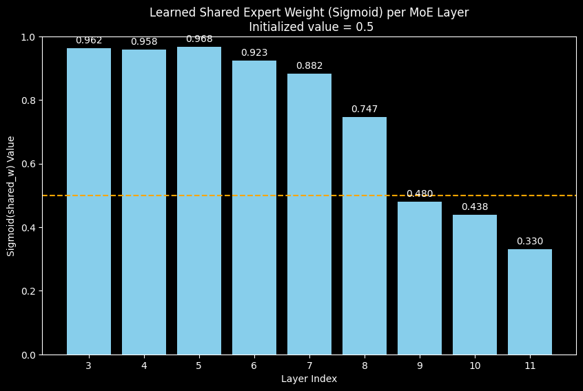
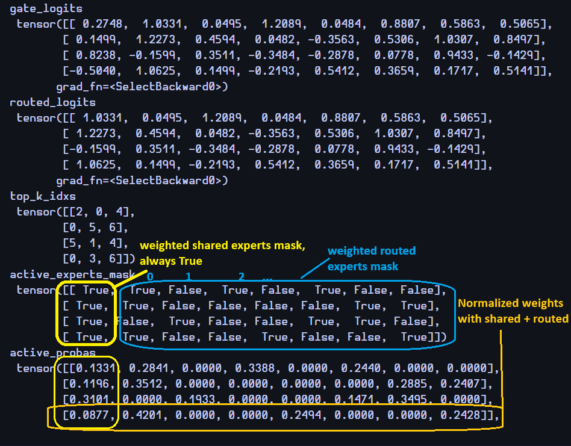

# Temp journal

## MoE

### Weighting shared experts?

There's no mention of weighting shared experts in DeepSeek models (they implicitly did though1), but we could try. The hypothesis in mind, is that we
don't always need the full information of shared knowledge, letting the model learn and apply a % of the full shared
knowledge can be enough sometimes. Thus weighting shared knowledge along specialized knowledge could have been
interesting.  

One problem is how do we achieve a proper weight balance of experts that are always chosen?

- if we include them in the aux loss free balancing, they're going to skew the routed experts + their weight will
  converge to 0, as the violation error will keep applying a never ending increasing negative bias.

- if we don't include them and normalize them (with routed ones), as they're always selected, their importance will keep
  increasing, their weight converging to 1, and we'll end up outweighing the specialized knowledge.

- A fixed weight coefficient seems too rigid.

&nbsp;

Some intuitive ways that came to mind:

#### a) scalar weighting

We let the model learn and adjust a fixed param $p$ via backprop, in order to keep things in bounds, $p$
is passed to a sigmoid $\sigma$, so the weight applied is between 0 and 1.  
This way each layer can independently decide how much shared knowledge they'll transmit. Eg, maybe complex
representation layers will require less common knowledge to focus more on spec and vice versa.

I also had to use a high custom learning rate for this specific gradient because updates were super small with
$\frac{\partial \text{loss}}{\partial \sigma}$ aggravating the problem. So we end up with:

$$ \text{Shared Output} = \sum_{i=1}^{N_{\text{shared}}} \sigma\big( p \big) \cdot \text{FFN}_i, \quad p \in \mathbb{R},
\quad \sigma(p) = \frac{1}{1+e^{-p}} \in (0, 1) $$

After a few small tests, the model indeed tends to regulate the shared knowledge by applying a decreasing linear (at
worst, monotonic) amount of it as we progress through deeper layers.

1 This could explain a part of why DeepSeek chose to directly use 3x FFN for the first 3 layers, which is
inherently shared knowledge acquisition only without using any sort of weighting.  

This requires many more experiments to see if there is an actual benefit in perplexity for DeepSeekMoE based models.

#### b) individual (per embedding) weighting

- alternatively instead of a scalar $p$, for some more granularity, we could have a learnable vector ${\vec{p} \in
  \mathbb{R}^{emb\ dim}}$.  
  Same as **a)** but to normalize the weights we could use a softmax or individual sigmoids (like DeepSeek did for
  weighting routed ones).

$$ \text{Shared Output} = \sum_{i=1}^{N_{\text{shared}}} \text{softmax}(\vec{p}) \cdot \text{FFN}_i, \quad \vec{p} \in
\mathbb{R}^{emb\ dim} $$ 

#### c) dynamic weighting

- the easy way would be adding a small dedicated ffn to output a dynamic scalar $p$ or vector $\vec{p}$, but that's a
  lot of added params to train just for weighting and redundant with the main MoE gate.

---

TODO 

wrong method: attempt to normalize routed+shared together, will overweight shared and underweight routed on the long run

Output example with a batch `rand_x = torch.rand(2, 4, 768)`, `num_experts=8`, `num_shared_experts=1`, `top_k=3`, (only
the first seq is shown): 

