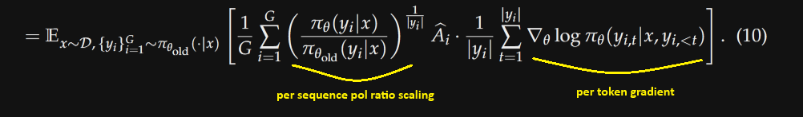

# Qwen GSPO (Group Sequence Policy Optimization) from scratch

[Qwen's GSPO](https://www.arxiv.org/abs/2507.18071), which helped scale RL in their recent very competitive Qwen3
models (at the time of writing) is pretty similar to DeepSeek's GRPO. We can say it's GRPO with primarily a single difference.  
The policy ratio (or importance ratio) is changed to being less granular. Instead of getting per tokens
(log)probs, and applying the ratio per token like:
$w_{i,t}(\theta) = \frac{\pi_{\theta}(y_{i,t}|x, y_{i,<t})}{\pi_{\theta_{old}}(y_{i,t}|x, y_{i,<t})}$

we compute the ratio per sequence $s_i(\theta) =\frac{\pi_{\theta}(y_i|x)}{\pi_{\theta_{old}}(y_i|x)}$. Since the prob
of a sequence is the product of its tokens' probs $\prod_{t=1}^{|y_i|} \pi_{\theta}(y_{i,t}|x, y_{i,<t})$ or
for the code implementation, in logspace, the sum of logprobs $\sum_{t=1}^{|y_i|} \log \pi_{\theta}(y_{i,t}|x,y_{i,<t})$,
we still need to compute the logprobs per token, just like GRPO, in order to get the ratio per
sequence/trajectory.

It now also matches the same shape as the Advantages $A_i$ in outcome supervision GRPO, ie we have a single reward per
sequence/trajectory and thus advantage.  
This is the main reason Qwen introduced GSPO, as they said: *"the unit of optimization objective should match
the unit of reward"*, the policy ratio and the (PPO) clipping are now applied per sequence (and not per token
anymore).

In order to avoid bias of long vs short sequences, they normalize for length by taking the geometric mean of per-token
probs for both policies:

$s_i(\theta) = \left(\prod_{t=1}^{|y_i|}
\frac{\pi_{\theta}(y_{i,t}|x,y_{i,<t})}{\pi_{\theta_{\text{old}}}(y_{i,t}|x,y_{i,<t})}\right)^{\frac{1}{|y_i|}} =
\left(\frac{\pi_{\theta}(y_i|x)}{\pi_{\theta_{old}}(y_i|x)}\right)^{\frac{1}{|y_i|}}$

or again in logspace (for the code implementation, we'll simply use the arithmetic mean):

$\log s_i(\theta) = \log\left[\left(\prod_{t=1}^{|y_i|}
\frac{\pi_{\theta}(y_{i,t}|x,y_{i,<t})}{\pi_{\theta_{\text{old}}}(y_{i,t}|x,y_{i,<t})}\right)^{\frac{1}{|y_i|}}\right]$

$= \frac{1}{|y_i|}\log\left(\prod_{t=1}^{|y_i|}
\frac{\pi_{\theta}(y_{i,t}|x,y_{i,<t})}{\pi_{\theta_{\text{old}}}(y_{i,t}|x,y_{i,<t})}\right)$ (since $\log(a^b) = b
\log (a)$ )

$= \frac{1}{|y_i|} \cdot \sum_{t=1}^{|y_i|}
\log\left(\frac{\pi_{\theta}(y_{i,t}|x,y_{i,<t})}{\pi_{\theta_{old}}(y_{i,t}|x,y_{i,<t})}\right)$ (since
$\log(\prod_{i=1}^n a_i) = \sum_{i=1}^n \log(a_i)$ )

and taking the exponential of both sides, we end up back with their *equation 7* from the paper:

$s_i(\theta) = \exp\left(\log s_i(\theta)\right) = \exp\left(\frac{1}{|y_i|}
\sum_{t=1}^{|y_i|}\log\left(\frac{\pi_{\theta}(y_{i,t}|x,y_{i,<t})}{\pi_{\theta_{old}}(y_{i,t}|x,y_{i,<t})}\right)\right)
=\left(\frac{\pi_{\theta}(y_i|x)}{\pi_{\theta_{old}}(y_i|x)}\right)^{\frac{1}{|y_i|}}$ (since $e^{b \log a}= a^b$)

&nbsp;

## Why Qwen judged important to match the granularity of the policy ratio with the advantages?

In GRPO, the gradient of each token's logprob is individually scaled by its respective per-token policy ratio. However,
this granularity can be noisy (as a single sample estimate) and raises undesired variance, which on the long-term,
accumulates, and can lead to instability during training.  
Therefore, switching to a per-sequence policy ratio, now the gradients for all tokens within a sequence are weighted by
the same sequence-level policy ratio, and reduce the instability mentioned above.

Seen from their GSPO gradient *equation 10*:



&nbsp;

## Changes from the GRPO code

- The switch to GSPO induces retweaking a less aggressive (PPO) clipping $\epsilon$ hparam, where they mention using
$\epsilon$ in the ~$10^{-4}$ range compared to the typical ~0.2 default we often see. In hindsight, it makes sense
since it's not token based anymore with less variance and a different order of magnitude.

- we create a new function `log_probs_per_seq` that reuses `log_probs_per_token` from `grpo_engine.py` to compute the
  logprobs per token and uses the `loss_mask/reward_mask` to correctly calc the mean only for the logprobs of the generated
  tokens.

    then we can use as a drop-in replacement for the `rlhf_grpo_training_loop` or `rlvr_grpo_training_loop`:

    ```python
    # instead of [pol/old]_logprobs = log_probs_per_token(logits, inputs, loss_mask)
    seq_pol_logprobs = log_probs_per_seq(logits, inputs, loss_mask)
    seq_old_logprobs = log_probs_per_seq(logits, inputs, loss_mask)
    seq_policy_ratio = torch.exp(seq_pol_logprobs - seq_old_logprobs)
    
    # in the grad loop...
    # no need to unsqueeze the advantages anymore, both shapes are (B,)
    surr_obj_per_sequence = policy_ratio_per_sequence * advantages
    clipped_surr_obj_per_sequence = torch.clip(
        policy_ratio_per_sequence, min=1.0 - eps_clip, max=1.0 + eps_clip
    ) * advantages
    ```