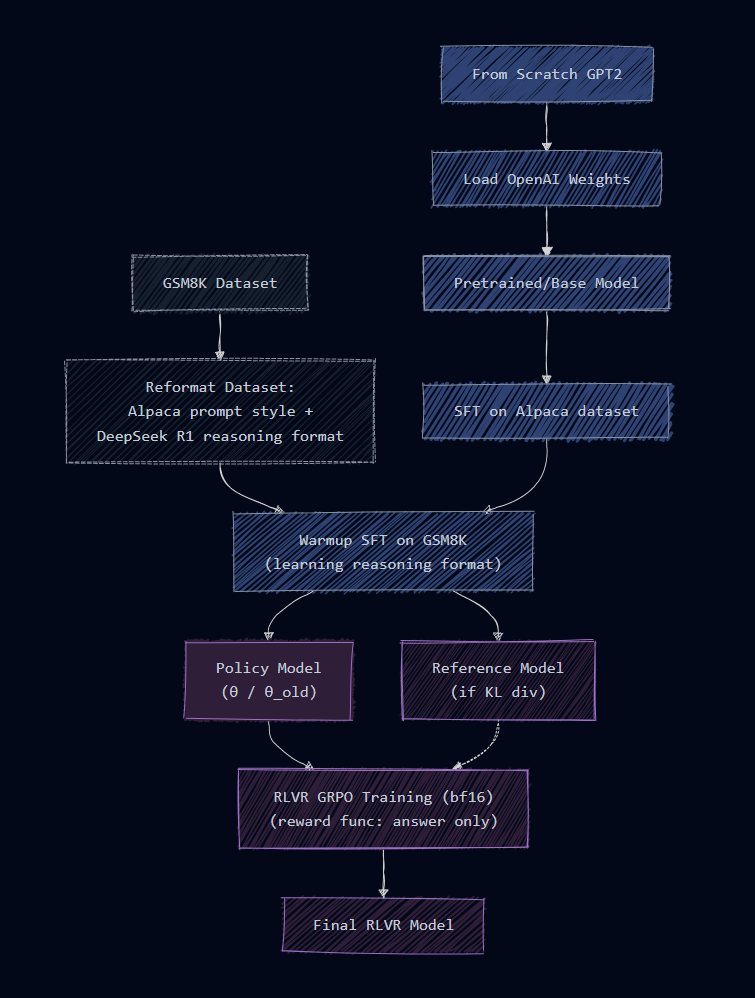
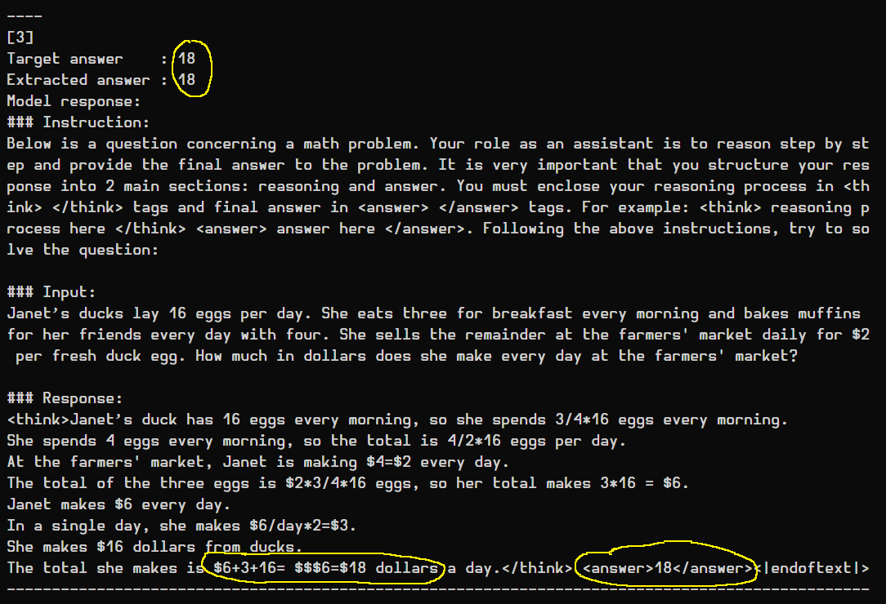

# Reasoning from scratch with GPT2-M: RLVR with GRPO

This RLVR implementation is not based on a specific paper, but a mix of techniques used and depicted in the following resources:

- AI2 TULU 3: https://arxiv.org/abs/2411.15124
- DeepSeek R1: https://arxiv.org/abs/2501.12948
- RLHF book by [@natolambert](https://github.com/natolambert) *(also core author of TULU 3)*:
  https://rlhfbook.com/c/14-reasoning.html
- Structure/code re-used from https://github.com/casinca/LLM-quest/tree/master/llm_quest/alignment/rlhf_grpo
- Dataset: https://huggingface.co/datasets/openai/gsm8k

*Unlike RLHF with GRPO from scratch, where only `tiktoken` was a dependency, here I'm using HuggingFace's tokenizer, for
its efficient (batching) `decode` method.*

&nbsp;

## Pipeline


(similar to the RLHF one)



&nbsp;

## Results

Initially, training was done with the from-scratch GPT2 without a KVcache. It was too slow even for testing
purposes. Later, implementing the KVcache sped up generation but didn't change the main problem of a too basic SFT phase:

GRPO can be considered a "relative comparison algorithm", it computes advantages via z-scores across sampled
responses for the same prompt.  
When all sampled responses receive the same reward (whether all wrong or all correct), the z-scores collapse to zero and
the surrogate objective produces **no gradient signal**.  
This is the reason `phantom_reward` was added to the `z_scores` function (a phantom reward of 0 appended to each group
before z-scoring). This breaks the std=0 in the denominator of the adv/z-score formula when all real rewards are equal but non-zero, creating some variance.

(However, if we set `wrong_answer_reward=0` the phantom reward trick has no effect. The only surviving
gradient is then the KL divergence penalty, which just anchors the policy to the reference model.)

To sum up, GRPO requires the model to produce correct answers more often in its rollouts. Even one
correct response in a group creates reward variance and a positive advantage to reinforce. But the simplistic/short SFT
on Alpaca and GSM8K rarely produces a correct numerical answer, so the training loop has little to reinforce.

We sometimes end up with good answers but wrong reasoning



Similar GRPO training with a more recent model (from-scratch Qwen3-0.8B) is done in the [Reinforcement
Pretraining](https://github.com/casinca/LLM-quest/tree/master/llm_quest/reinforcement_pretraining/) section.

&nbsp;

## Additional notes:

### Importance of Process supervision vs Outcome supervision

During SFT warmup to learn the reasoning format (not RLVR yet), the example below could definitely
happen during RL, where the model gets the right answer but the reasoning completely wrong.  
With outcome supervision, the model would get a positive reward for the right answer and indirectly reward a wrong
reasoning trajectory.  
Hence the importance of process supervision and shaping proper rewards for the reasoning process.

```
### Instruction:
Below is a question concerning a math problem. Your role as an assistant is to reason step by step and provide the final answer to the problem. It is very important that you structure your response into 2 main sections: reasoning and answer. You must enclose your reasoning process in <think> </think> tags and final answer in <answer> </answer> tags. For example: <think> reasoning process here </think> <answer> answer here </answer>. Following the above instructions, try to solve the question:

### Input:
A robe takes 2 bolts of blue fiber and half that much white fiber.  How many bolts in total does it take?

Correct response:
<think>It takes 2/2=<<2/2=1>>1 bolt of white fiber
So the total amount of fabric is 2+1=<<2+1=3>>3 bolts of fabric</think> <answer>3</answer>

Model response:
<think>It takes 2 x 2 = <<2*2=2>>2 bolts of blue fiber
2 x 1.5 = <<2*1.5=2>>2 bolts of white fiber
So the total is 3 x 2 = <<3x2=3>>3 bolts</think> <answer>3</answer>
```


