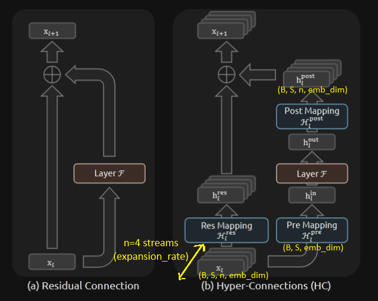
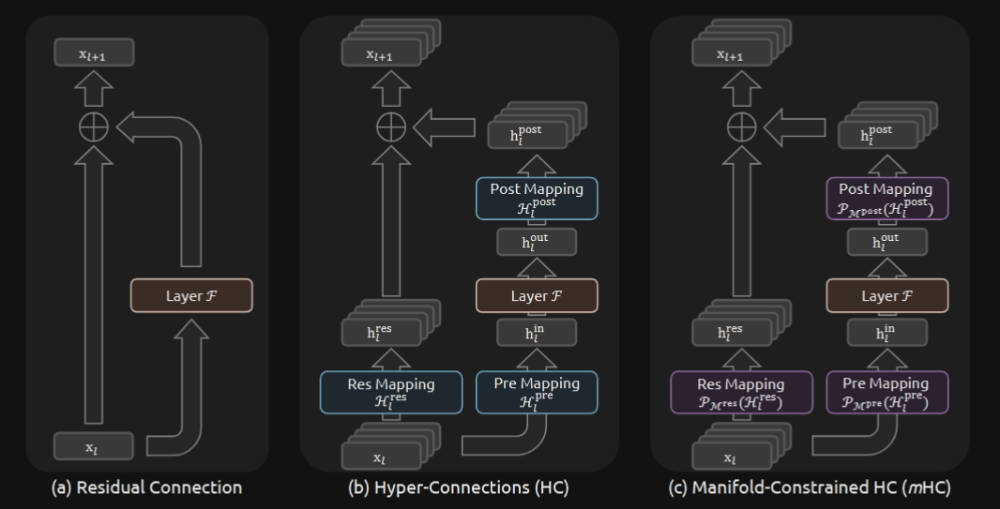
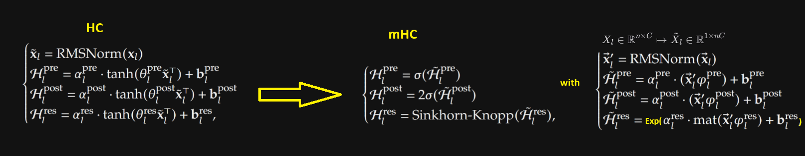
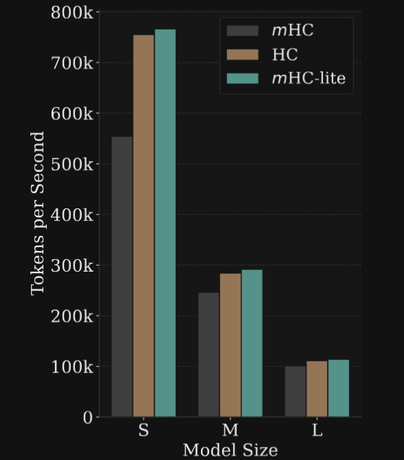

# Hyper-connections

Table of Contents:
- [Classic (unconstrained) Hyper-connections](#classic-unconstrained-hyper-connections)
  - [Where does the term "Hyper-connections" come from and example with H_res?](#where-does-the-term-hyper-connections-come-from-and-example-with-h_res)
  - [Problems with classic (unconstrained) hyper-connections](#problems-with-classic-unconstrained-hyper-connections)
- [DeepSeek Manifold-Constrained Hyper-connections (mHC)](#deepseek-manifold-constrained-hyper-connections-mhc)
  - [Constraining H_res](#constraining-h_res)
  - [mHC-lite: Optimizing mHC to get faster and exact doubly stochasticity](#mhc-lite-optimizing-mhc-to-get-faster-and-exact-doubly-stochasticity)
  - [Quick throughput comparison](#quick-throughput-comparison)
- [Acknowledgements](#acknowledgements)
  

&nbsp;

*note1: Equations 1, 2, 5, 6 and 8 are taken from the DeepSeek mHC paper.*  


## Classic (unconstrained) Hyper-connections

Hyper-connections are an alternative to the traditional residual/skip connections that are now standard in transformer
architectures, originally introduced in ResNet.

<div align="center">
    
    <p>Fig 1 from the DeepSeek mHC paper</p>
</div>

&nbsp;

For example instead of having for a single sub-layer/part (Attention or ffn/MoE) of a transformer block the usual output as:

$$
\mathbf{x}_{l+1} = \mathbf{x}_l + \mathcal{F}(\mathbf{x}_l, \mathcal{W}_l)
\qquad (1)
$$

with:
*   **$\mathbf{x}_l$**: the untouched input residual/skip connection (the *identity mapping* as DeepSeek calls it, if we
    see it as a function $f(x) = x$ where the input is unchanged)
*   **$\mathcal{F}(\mathbf{x}_l, \mathcal{W}_l)$**: the residual function/layer modifications from the Attention or
    ffn/MoE in the trf block

&nbsp;

Hyper-connections add "width" to the stream. The main stream is expanded into n (hyperparameter `expansion_rate`)
expanded streams and the residual connection/untouched input is replaced by a "hyper-connection" $\mathcal{H}_l^{\text{res}}\mathbf{x}_l$.

$H_l^{\text{res}}$ (residual mapping) is a dynamically generated matrix/weights that will determine how much each of the n expanded streams
contributes to each other.  
For instance with n=4 expanded streams, for S1, we need to know how much of S1, S2, S3, and S4 to include 
(*mixes features within the residual stream* as DeepSeek put it). 
This is why $H_l^{\text{res}} \in \mathbb{R}^{n \times n}$

For a single sub-layer/part (Attention or ffn/MoE) of a transformer block, we get:

$$
\mathbf{x}_{l+1} = \underbrace{\mathcal{H}_l^{\text{res}} \mathbf{x}_l}_{\text{Residual stream branch}} +
\underbrace{{\mathcal{H}_l^{\text{post}}}^\top \mathcal{F}(\mathcal{H}_l^{\text{pre}} \mathbf{x}_l,
\mathcal{W}_l)}_{\text{Residual function branch}}
\qquad (2)
$$

&nbsp;

Since we can't just pass these n streams to the attention (or ffn/MoE) sub-layer as it would increase the time
complexity by a factor of n, we have 2 additional hyper-connections to handle the residual function/layer transformation
branch $\mathcal{F}$:
- the contraction (pre-mapping $\mathcal{H}_l^{\text{pre}}$) which collapses the n expanded streams into a single stream
  for the transformer block input (attention input or ffn/MoE input to be specific).  
  This is a weighted sum of the n streams using the dynamically generated $\mathcal{H}_l^{\text{pre}}$ weights.

- and expansion (post-mapping $\mathcal{H}_l^{\text{post}}$) which broadcasts the single stream output of the
  residual function/sub-layer (attention or ffn/MoE) branch back to the n expanded streams.  
  $\mathcal{H}_l^{\text{post}}$ will weight how much the residual function/sub-layer transformation (output from $\mathcal{F}$) contributes to each of the n expanded streams.


&nbsp;

### Where does the term "Hyper-connections" come from and example with H_res?

The term "hyper-connection" is derived from HyperNetworks, as the original HyperNetworks paper abstract mentions:
*Hypernets are neural networks that generate the weights of other neural networks.*

Let's take the example of a traditional single linear layer without bias, we have:

$$
y = W \cdot x
\qquad (3)
$$

- During training, the weights in $W$ are not fixed (they are learned through backprop) but during
  inference, they are set in stone. So we have fixed weights.

For a "HyperLinear" layer, instead of having a fixed weight matrix $W$, we have a 2nd small linear layer
$H(x)$ that learns to generate a weight matrix $W$ on the fly based on the input $x$.

So we end up with:

$$
y = H(x) \cdot x
\qquad (4)
$$

- Whether during training or inference, the weights here are not fixed, a new $W$ is generated by $H(x)$ on the fly.

&nbsp;

To make the parallel with hyper-connections here, in our case $H(x)$ can be $\mathcal{H}_l^{\text{res}}$ from the mHC paper eq 5.

Which is the result of a single layer ffn that is Tanh activated, with a scaling factor $\alpha$ and a bias $\mathbf{b}$:

$$
\mathcal{H}^{\text{res}} = \alpha \cdot \tanh(\theta \mathbf{x}^\top) + \mathbf{b}
\qquad (5)
$$

It's also important to note that the scaling factor $\alpha$, dynamic mapping ($\theta$) and static mapping (bias) are
all specifically initialized to make $\mathcal{H}^{\text{res}}$ start as an identity matrix 
(i.e. $\mathcal{H}^{\text{res}}= I$). This is done to mimic the behavior of a classic residual connection at the start of training for stability ($I \cdot \mathbf{x}_l = \mathbf{x}_l$).

&nbsp;

Hence the term "hyper-connections", instead of having a fixed weight matrix $W$ that could have scaled/mixed features
within the residual stream as $\mathbf{x}_{l+1} = W \cdot \mathbf{x}_l$, we have a small "neural network" (1 layer) that
generates the weights $\mathcal{H}_l^{\text{res}}$ on the fly 
$\mathbf{x}\_{l+1} = \mathcal{H}_l^{\text{res}} \cdot \mathbf{x}_l$

&nbsp;

An analogy could be a comparison with LoRA (omitting the efficiency goal of LoRA), we can think of Hyper-Connections as dynamic or context-aware LoRA.  
In standard LoRA, we can manually swap the adapters, but these are fixed set of low-rank matrices that apply the
same modification to every input during inference. With Hyper-Connections, we essentially generate/swap a
custom LoRA adapter on the fly, tailoring the weights specifically to the current context.  
(Unlike LoRA, though, which adds a correction to existing static weights ($W + \Delta W$), these dynamic matrices here act as the standalone weights)

&nbsp;

### Problems with classic (unconstrained) hyper-connections

A typical transformer block is composed of the attention and ffn/MoE parts, and a model has multiple sequential
transformer blocks. Therefore the output $\mathbf{x}_L$ of a given sub-layer/part (Attention or ffn/MoE) of a
transformer block is the addition of $\mathbf{x}_l$ the identity mapping or "untouched input" and the cumulative sum of
residual functions/layer modifications $\mathcal{F}$ from previous layers (or sub-layer if within the same trf block).  

$$
\mathbf{x}_L = 
\underbrace{\mathbf{x}_l}_{\text{intact}} + \sum_{i=l}^{L-1} \mathcal{F}(\mathbf{x}_i, W_i),
\qquad (6)
$$

Ex:

$$
\begin{aligned}
\mathbf{x}_1 &= \mathbf{x}_0 + \mathcal{F}(\mathbf{x}_0) \\
\mathbf{x}_2 &= (\underbrace{\mathbf{x}_0 + \mathcal{F}(\mathbf{x}_0)}_{ \mathbf{x}_1}) + \mathcal{F}(\mathbf{x}_1) \\
\mathbf{x}_3 &= \mathbf{x}_0 + \sum_{i=0}^{2} \mathcal{F}(\mathbf{x}_i)
\end{aligned}
$$

As we can see with a classic residual connection, these sequential modifications aren't a problem, the identity mapping is kept intact and only modified by the cumulative sum of residual function/layer modifications 
$\mathcal{F}$.

&nbsp;

This is what we want for a good gradient flow during backprop (and the main point of having a residual connection), if
we take the derivative of vectors $x_L$ wrt $x_l$, we get the Jacobian:

$$
\frac{\partial \mathbf{x}_L}{\partial \mathbf{x}_l} = \prod_{i=L-1}^{l} \frac{\partial \mathbf{x}_{i+1}}{\partial \mathbf{x}_i}
= \prod_{i=L-1}^{l} \left( \frac{\partial \mathbf{x}_i}{\partial \mathbf{x}_i} + \frac{\partial \mathcal{F}(\mathbf{x}_i)}{\partial \mathbf{x}_i} \right)
= \prod_{i=L-1}^{l} \left( I + \frac{\partial \mathcal{F}(\mathbf{x}_i)}{\partial \mathbf{x}_i} \right)
\qquad (7)
$$

The residual connection Jacobian $\frac{\partial \mathbf{x}_i}{\partial \mathbf{x}_i}$ is the identity matrix $I$ and guarantees that
however small the Jacobian from the product of residual functions $\mathcal{F}$ is, we'll still get a good gradient
signal (no vanishing gradient problem).

<details>
<summary>About the Jacobian and being the identity matrix</summary>

A Jacobian is a matrix that can be seen as a container of all the partial derivatives of each output with respect to
each input. Just like a gradient is a vector of partial derivatives, a Jacobian is a matrix of partial derivatives.

When row $i$ = column $j$, i.e. the diagonal partial derivatives, $\frac{\partial x_i}{\partial x_i} = 1$. When $i \neq j$, i.e.
$\frac{\partial x_j}{\partial x_i}$, the partial derivative is 0. Overall, this gives us exactly the identity matrix
$I$.

</details>


&nbsp;

Whereas with hyper-connections, the dynamic weights $\mathcal{H}_l^{\text{res}}$ modify the input $\mathbf{x}_l$ (loses the
identity property vs eq. 6) for each of the n streams every iteration:

$$
\mathbf{x}_L = 
\underbrace{\left( \prod_{i=l}^{L-1} \mathcal{H}_{L-i}^{\text{res}} \right) \mathbf{x}_l}_{\text{not intact}}+ \sum_{i=l}^{L-1} \left(\prod_{j=1}^{L-1-i} \mathcal{H}_{L-j}^{\text{res}} \right)\mathcal{H}_i^{\text{post} \top}\mathcal{F}(\mathcal{H}_i^{\text{pre}} \mathbf{x}_i, W_i)
\qquad (8)
$$

&nbsp;

If we just focus on a single residual connection branch, for simplicity, $\mathcal{H}_{l}^{\text{res}} \mathbf{x}_l$ and
take the Jacobian wrt $\mathbf{x}_l$ we get (let's not forget that $\mathcal{H}\_{l}^{\text{res}}$ is also dependent on
$\mathbf{x}_l$, see eq 5):

$$
\frac{\partial \left(\mathcal{H}_l^{\text{res}}(\mathbf{x}_l) \cdot \mathbf{x}_l \right)}{\partial \mathbf{x}_l}
= \mathcal{H}_l^{\text{res}}(\mathbf{x}_l) + \frac{\partial \mathcal{H}_l^{\text{res}}(\mathbf{x}_l)}{\partial
\mathbf{x} _l} \cdot \mathbf{x}_l
\qquad (9)
$$


Eq 9 is just for a single case of a local Jacobian, but we need to see it as going through multiple layers (chain rule),
so the first term would be a product $\prod_{i=L-1}^{l}\mathcal{H}_{i}^{\text{res}}$, that's where the
compounding instability comes from.

&nbsp;

We already have the usual instability during backprop from the 2nd terms/residual function branch (whether eq. 8 for HC
or eq. 6 for classic residual) but now with HC, the residual connection branch switches from a
product of identity matrix $I$ to a product of dynamic weights $\mathcal{H}_l^{\text{res}}$ (*ignoring the 2nd term of
eq. 9 as it's not the dominant term*).  

These new cumulative products during training deviate from the initial goal of having an "untouched" residual/identity
mapping $\mathbf{x}\_l$ for stable gradient flow. This can now lead to instability and degradation in large scale
training because of potentially poor gradient signal flowing back, as DeepSeek explains (since it's exponential can
easily vanish/explode if $\prod_{i=L-1}^{l}\mathcal{H}_{i}^{\text{res}}$ is small/large, see Figure 3(b) from the mHC paper).

&nbsp;

This is the very problem that DeepSeek wants to improve with their mHC paper. Hence the term *"unconstrained"
hyper-connections* with regard to $H_l^{\text{res}}$ and the *DeepSeek manifold-"constrained" hyper-connections*.

&nbsp;

## DeepSeek Manifold-Constrained Hyper-connections (mHC)


<div align="center">
    
    <p>Fig 1 from the DeepSeek mHC paper</p>
</div>

*note2: We are now calling the original hyper-connections* $H_l^{\text{res}}$*,* $\mathcal{H}_l^{\text{pre}}$ *and*
$\mathcal{H}_l^{\text{post}}$ *as* $\widetilde{\mathcal{H}}_l^{\mathrm{res}}$*,*
$\widetilde{\mathcal{H}}_l^{\mathrm{pre}}$ *and* $\widetilde{\mathcal{H}}_l^{\mathrm{post}}$ *to match the mHC paper notation. This is done to avoid confusion between unconstrained and constrained hyper-connections.*  
*note3: DeepSeek made heavy use of custom kernels to reduce overhead, these are not implemented.*

&nbsp;

Even if the main problem is with $\widetilde{\mathcal{H}}_l^{\mathrm{res}}$, it's not the only matrix being
constrained: $\widetilde{\mathcal{H}}_l^{\mathrm{pre}}$ and $\widetilde{\mathcal{H}}_l^{\mathrm{post}}$ are also
constrained to be non-negative (they are mapped by a sigmoid function instead of a tanh function).

*(A little detail, previously in HC, only* $\theta_l \tilde{\mathbf{x}}_l^\top$ *(see eq. 5 and mapping changes figure below) were mapped. In mHC, both the biases and the scaling factors* $\alpha_l$ *are also mapped.)*

The reason, quoting the mHC paper, is *"this constraint prevents signal cancellation arising from the composition of
positive and negative coefficients, which can also be considered as a special manifold projection."*

Another implementation detail with mHC is that the input used to generate all the mappings ($\mathcal{H}$ matrices) is flattened to a row
vector $\mathbb{R}^{n \times C} \to \mathbb{R}^{1 \times nC}$ *to preserve full context information*, as
DeepSeek put it.

<div align="center">
    
    <p>Mapping changes, from classic HC to DeepSeek mHC to mHC-lite</p>
</div>

&nbsp;

### Constraining H_res

How does DeepSeek keep the best of both worlds? Stability from classic residual connection and the mixing benefits of
hyper-connections?  
They constrain the residual mapping/matrix $\mathcal{H}_l^{\text{res}}$ to be doubly stochastic (i.e., a matrix where
each row and each column sums to 1 and all values are non-negative). We can see it as a matrix where both rows and
columns were softmax'ed/sum to 1 in both directions.

Why does it help?

- If rows are convex combinations (scalars sum to 1 and each >0*) then, in the forward pass, the output of
  $\mathcal{H}_l^{\text{res}} \mathbf{x}_l$ becomes a weighted average of the input $\mathbf{x}_l$, thus the output will
  always be bounded between the min and max scalars of the input $\mathbf{x}_l$. The same holds for columns in the
  backward pass and helps keep gradients bounded.  
  More importantly, both conditions guarantee that the $\mathcal{H}_l^{\text{res}}$ matrix will not increase the
  magnitude (L2 norm) of the input vector, nor the propagated gradients (i.e. it's non-expansive, spectral norm ≤ 1).

- Another good property that helps with the problem of cumulative products
  $\prod_{i=L-1}^{l}\mathcal{H}_{i}^{\text{res}}$ across layers, that we mentioned in the previous section, is that if
  we multiply 2 doubly stochastic matrices, the result is also a doubly stochastic matrix.  
  This is the "Compositional Closure" that DeepSeek mentions on p. 8.

&nbsp;

DeepSeek uses the Sinkhorn-Knopp (SK) algorithm to make the matrices $\mathcal{H}^{\text{res}}$ doubly stochastic. We
use a PyTorch adaptation of the NumPy implementation mentioned in the Acknowledgements section.

It is worth noting that we apply the exponential function to $\widetilde{\mathcal{H}}_l^{\mathrm{res}}$ to obtain a
strictly positive matrix, since SK requires this to guarantee convergence to a doubly stochastic matrix.

Switching from a classic residual connection to mHC from scratch in Pytorch has some overhead here, hence
why DeepSeek dedicate a rigorous section (4.3. Efficient Infrastructure Design) to how they optimized it.

&nbsp;

### mHC-lite: Optimizing mHC to get faster and exact doubly stochasticity

Instead of using SK to make $\exp(\widetilde{\mathcal{H}}^{\mathrm{res}})$ doubly stochastic, 2 researchers had the
great idea to leverage the Birkhoff-von Neumann (BVN) theorem to compute $\mathcal{H}^{\mathrm{res}}$ directly from a
convex combination of permutation matrices (DeepSeek does mention that the Birkhoff polytope is the convex hull of
permutation matrices, but doesn't explicitly exploit this for the parameterization).

As the name of the paper suggests, *"you don't need 20 Sinkhorn-Knopp iterations"*, 20 being the default hyperparameter
DeepSeek used for SK.

A problem with SK is that it's an approximation compared to BVN, so there's always a risk of a residual mapping
$\mathcal{H}^{\mathrm{res}}$ not being exactly doubly stochastic. Another issue is applying the exponential function, it
increases the distance (exponentially) between values which can slow down the convergence/requires more iterations.

&nbsp;

In the code, we pass the `weight_a` vectors $\in \mathbb{R}^{seq\_len \times n!}$ (with $n$ being the expansion rate),
resulting from 
$\mathrm{softmax}\left(\alpha_l^{\mathrm{res}} \hat{\mathbf{x}}_l' W_l^{\mathrm{res}} +b_l^{\mathrm{res}}\right)$ 
in `MHCLiteRes`, to the `BirkhoffvonNeumann` object, in order to get our doubly stochastic
matrix $\mathcal{H}^{\mathrm{res}}$

&nbsp;

### Quick throughput comparison

Comparing quickly locally in 200 steps our HC, mHC and mHC-lite, the results seem in line with the papers/expectations:

```bash
2.9 steps/s # mHC-lite
2.5 steps/s # mHC (iter_check=3)
2.7 steps/s # mHC (iter_check=1)
1.4 steps/s # mHC (iter_check=20) # case where all convergences are slow and take 20 iters
2.9 steps/s # HC
```

`iter_check` is a hparam of the `SinkhornKnopp` class that checks for convergence every `iter_check` iterations and
break early from SK if doubly stochastic vs checking after 20 steps. It's not mentioned in the DeepSeek mHC paper, but
they surely have thought about it, 20 iters is just the upper limit to find convergence.

<div align="center">
    
    <p>Figure 5 token throughput of the mHC-lite paper</p>
</div>


**technically, "non-negative" is the condition for convex combinations, but since we map via the exponential function
here, I use strictly positive.* 

&nbsp;

## Acknowledgements

- [Hyper-connections](https://arxiv.org/abs/2409.19606)
- [mHC: Manifold-Constrained Hyper-Connections](https://arxiv.org/abs/2512.24880)
- [HyperNetworks](https://arxiv.org/abs/1609.09106)
- [Deep Residual Learning for Image Recognition](https://arxiv.org/abs/1512.03385)
- [Reference Sinkhorn-Knopp NumPy Implementation](https://github.com/btaba/sinkhorn_knopp)
- [Sinkhorn-Knopp: Concerning Nonnegative Matrices and Doubly Stochastic Matrices](http://msp.org/pjm/1967/21-2/pjm-v21-n2-p14-s.pdf)
- [mHC-lite: You Don't Need 20 Sinkhorn-Knopp Iterations](https://arxiv.org/abs/2601.05732)