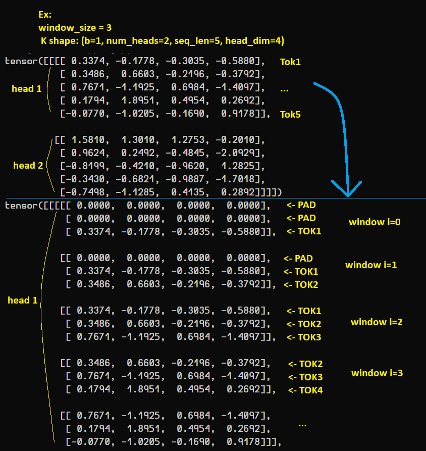
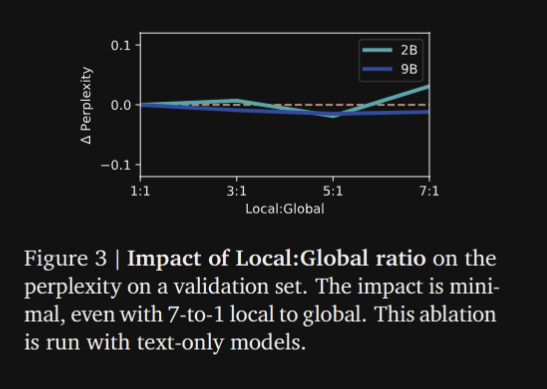
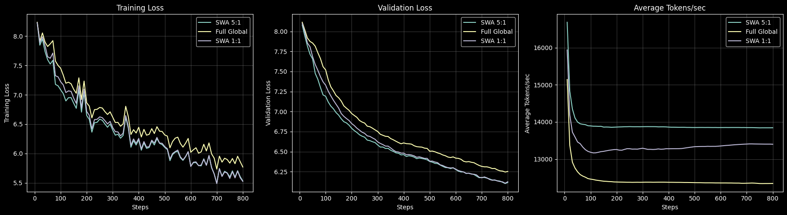

# From Llama 3.2 to Gemma 3 architecture from scratch

(This is an attempt at reimplementing the **Gemma training model** based on below-mentioned research papers only, not inference)

*Initially went for a Gemma2 architecture reimplementation but Google dropped their Gemma3 multimodal
technical paper, and since there isn't much difference (for text-only) from Gemma2, I switched to Gemma3:*

- Gemma papers:
  - Gemma3: https://arxiv.org/abs/2503.19786
  - Gemma2: https://arxiv.org/abs/2408.00118

**Gemma2 to Gemma3:**

- Switched the local:global attention ratio from 1:1 to 5:1 (first layer(0) = local)
  - local & global attention: https://arxiv.org/abs/1508.04025
- Removed Logits softcapping, added QK normalization instead, to avoid *attention entropy collapse (Zhai
et al.)*, ie, growing attention logits leading to attention weights becoming almost one-hot vectors (Similar to [MoE with
z-router loss](../moe/README.md#router-z-loss)).
    - logits softcapping: https://arxiv.org/abs/1611.09940
    - QK normalization: https://arxiv.org/abs/2302.05442
    - Dual RMSNorm: Most models use either pre or post normalization for the attention and the FFN block, Gemma3 does both.

**Common to Gemma2 and Gemma3:**

- Alternating Chunk Sliding Window Attention (SWA) (ie, classic SW, not dilated) and full attention:
  - Sliding Window Attention: https://arxiv.org/abs/2004.05150

- GeGLU: GELU + GLU
  - https://arxiv.org/abs/2002.05202  
 GeGLU is the same as SwiGLU (SiLU + GLU) but we replace the SiLU activation for GeLU.  
 The gate mechanism/bilinear transformation is the same.

    for reference:  
       - $\text{GeGLU}(x) = \text{GELU}(xW + b) \otimes (xV + c)$    
       - $\text{SwiGLU}(x) = \text{SiLU}(xW + b) \otimes (xV + c)$

- Weight tying

&nbsp;

## Additional details and tests

Trying to do SWA before $QK^T$ wasn't as straightforward as I expected... afaik there are 3 ways to do it:
  - Custom CUDA kernel (most efficient)
  - Pytorch, done pre attention matmuls O(w*n)
  - Pytorch, done post attention with the causal mask simulating a window, still O(n²)

I tried to do the 2nd approach, with padding and strides, ex of what it looks like with keys:

### Smoll test

The below Figure from Gemma 3 caught my eye and wanted to try if I'd get similar results with my from scratch 
implementation.

&nbsp;

On a low scale local test with a subset of FineWeb, mixing local and global attention 1:1, did improve the
loss over global attention and a noticeable boost concerning token/s. Sounds like it's working as intended.  
Going 5:1, over 1:1, gave similar losses but since we get more SWA layers, ++ token/s boost again.  

No surprise in Google making the right decision, as long as we keep perplexity withing good range, let's increase SWA
layers, it's just efficiency bonus.

