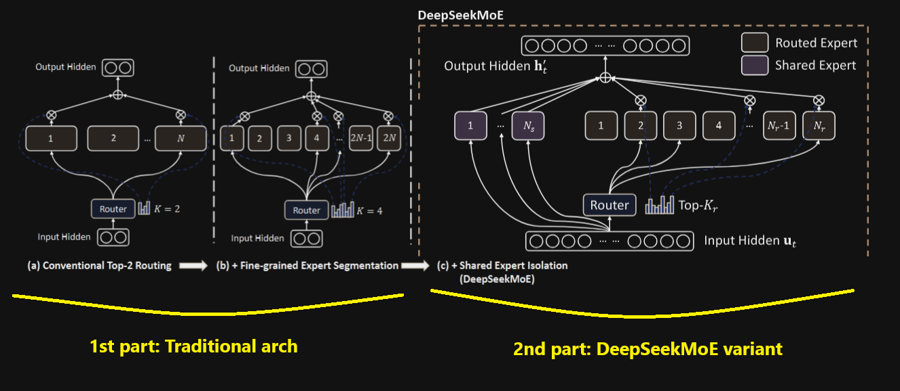
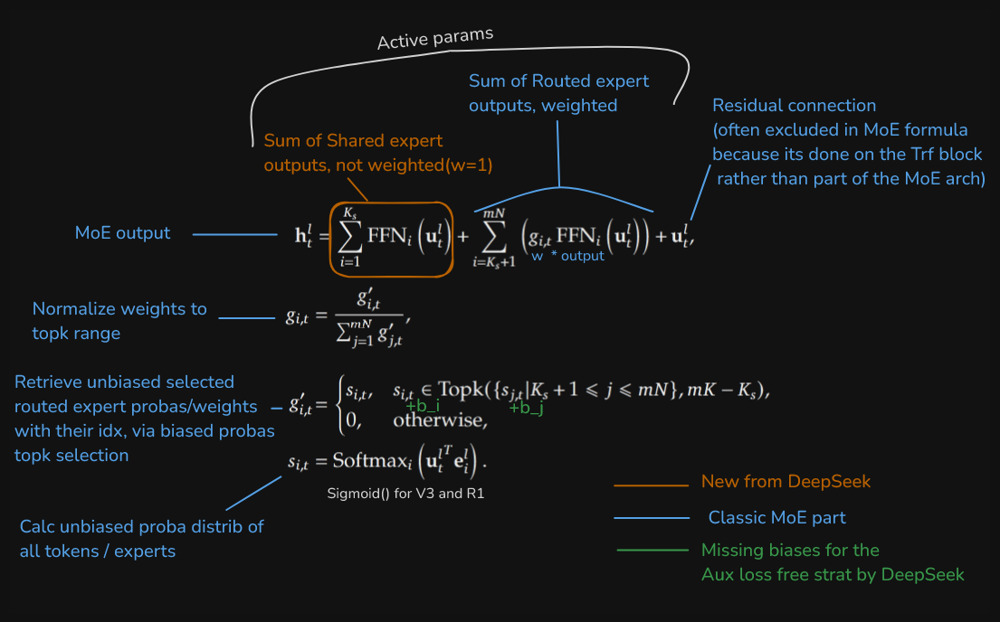

# Journal on MoE from scratch: Dense to classic sparse to DeepSeek MoE variant

*note1: Both implementations are solely based on research papers (that's the goal), all of them mentioned, are in the
[resources](#resources--acknowledgements) section.*  
*note2: og images from DeepSeek papers, edited by me*  
*note3: I'm loosely using the term "logits" for the raw output of the gate, before activation.*  

 
<!-- TOC -->

- [1. Traditional MoE:](#1-traditional-moe)
    - [a) The architecture implemented](#a-the-architecture-implemented)
    - [b) More details](#b-more-details)
- [2. DeepSeek MoE V2, V3 and R1](#2-deepseek-moe-v2-v3-and-r1)
    - [a) What changes from part 1](#a-what-changes-from-part-1)
    - [b) More details](#b-more-details)
- [Additional notes](#additional-notes)
- [Resources & Acknowledgements:](#resources--acknowledgements)
- [Mistakes](#mistakes)

<!-- /TOC -->

 

## 1. Traditional MoE:

### a) The architecture implemented:

- Gating mechanism: Linear layer

- Router: [Discrete](#alt-architecture-sparsediscrete-vs-densecontinuous) topk

- [Modular](#modular-experts) experts

- Auxiliary losses:
    - router z
    - load balancing

- Parallelism: No

- Expert Capacity (from Switch paper): No

### b) More details
---
#### Load balancing aux loss:  

##### Why using a local loss?
It has been observed that letting the gating network loose, creates a vicious circle, quoting Shazeer: *"It tends to converge to
a state where it always produces large weights for the same few experts. This imbalance is self-reinforcing, as the
favored experts are trained more rapidly and thus are selected even more by the gating network"*

##### Details
The first iteration of this was introduced by Shazeer with the Outrageous MoE paper in 2017, using CV (coefficient of
variation). He was also using an importance loss coupled with it.  
Here I went simple and classic, using a less complex version, which is the most commonly used (at the time of writing)
by Switch, ST-MoE, Mistral ([divergence with the paper](#mixtral-paper)) and others.  

Given $N$ experts indexed by $i = 1$ to $N$ and a batch $B$ with $T$ tokens, the auxiliary loss is computed as the
scaled dot-product between vectors $\mathbf{f}$ and $\mathbf{P}$:

$$\text{loss} = \alpha \cdot N \cdot \sum_{i=1}^N f_i \cdot P_i$$

$f_i$ and $P_i$ are two sides of the same coin, they calculate the same thing: the probability distribution of tokens
assigned to each expert.  
$f_i$ is discrete we will get a PMF and $P_i$ is continuous (but we select discrete values picked over the number of
experts.)  
Similar to Cross entropy, the dot product here penalizes if the predictions ($P_i$​) don't match the empirical results
$f_i$ we're seeing, but also high magnitudes (which imply overload).

- $f_i$ is the count of tokens dispatched to each expert divided by the number of tokens in the batch **\* topk** (see
mistakes).  
Ie, the fraction of tokens dispatched to each expert but in a discrete/empirical way since we "hard" count the freq of
selected experts.  
*Edit: I'm actually computing* $f_i$ *like DeepSeek and not the below formula. Instead of counting only the 1st of topk
(argmax) I'm counting the topk*

    $$f_i = \frac{1}{T} \sum_{x\in B} 𝟙 \{\text{argmax }p(x) = i\}$$

- $P_i$ is the average probability of each expert being selected, ie the mean of the softmax of the logits.

    $$P_i = \frac{1}{T} \sum_{x\in B} p_i(x)$$

- $\alpha$ is a hyperparameter. They tested and chose in both Switch and ST-MoE $\alpha = 10\text{e}^{-2}$

$f_i$ is not differentiable (discrete), $P_i$ (continuous) is, which helps because now we get a gradient from
$\frac{\partial \mathcal{L}\_{aux}}{\partial W_{gate}}$ that can update the parameters of the gate.

So we end up with a loss that should be minimized under a uniform distribution, which is what we want, ie balanced
experts load.

(Note: some implementations multiply by $N²$ instead of $N$, that's because they compute mean($f_i$ * $P_i$), so they
compensate the extra $\frac{1}{N}$ with $N^2$, ie $N^2 \cdot \frac{1}{N} = N$)

---
#### Router z loss 

The loss introduced by Google in the ST-MoE paper, aims to penalize large logits (from the gate output). This is
basically a differentiable L2 regularization term applied on logits. It prevents overconfidence of extreme imbalanced
probas (post-softmax). By reducing logits magnitude pre-softmax, distribution post-softmax is more balanced.  Eg,
avoiding logits [10, 0, 0] giving a distrib [1,0,0].

$$L_{z}(x) = \frac{1}{B} \sum_{i=1}^{B} \left( \log \sum_{j=1}^{N} e^{x_{j}^{(i)}} \right)^2 * c_z$$

- where $B$ is the number of tokens, $N$ is the number of experts, and $x \in \mathbb{R}^{B \times N}$ are the logits
  from the gate.

- we also add a coeff to scale this loss $c_z = 1\text{e}^{-3}$ by default.

 

The overall local goal of these losses is to have a better load balance but it shouldn't outweigh the main goal:
minimizing the CE loss. These coeff/hparams help with the scaling when we sum for the global loss.

---
#### Modular experts

The number of experts can be customized but also their hidden size.  
This gives us the choice of the common top2 routing or fine-grained expert segmentation for more targeted knowledge
acquisition (more details in DeepSeek MoE paper, section 3.1).

For example, let's consider an MoE layer with a fixed total number of parameters $P$ split in 16 experts, with top2, it
can yield $\binom{16}{2}$ = 120 combinations of experts/token.  
If we split each expert further by 4, $P$ split in 64 experts (each with 1/4 the hidden size of the original experts, to
adjust for the same $P$) and top8, we get $\binom{64}{8}$ ~ 4,4B combinations, with the same number of active parameters
(2 active larger experts to 8 smaller experts) and a more specialized region of the knowledge space.

---
#### Not using Noisy topk gating 

Introduced by Shazeer in Outrageous MoEs, after searching whether it was worth it, it seems it's not as commonly used
anymore, indeed more complex, needs careful tuning and computationally expensive. Adding learned Gaussian noise thanks
to another linear layer is helpful but adds another set of weights to train.  

The current DeepSeek trend demonstrated we can do pretty good with less complexity, ie GRPO, auxiliary loss free in our
case.

 

## 2. DeepSeek MoE (V2, V3 and R1)

### a) What changes from part 1. :

- Shared experts isolation

- Aux loss free load balancing (the main load balancing strat for V3 and R1, not present in V2)

    - complementary Aux losses:
        - Load balancing loss variant: counting all topk experts assigned, not just argmax
        - Device level balance loss: No

- Sigmoid for weighting experts (optional)

- max violation metric (optional)

### b) More details:

---
#### Auxiliary loss free load balancing:

A novel and lighter approach for load balance as it's not counting on gradient updates for guidance.  
They are injecting a bias vector ${\vec{b} \in \mathbb{R}^{num\ experts}}$, directly in the result (probas/scores) of the
softmax/sigmoid, these scores now biased, will only be used to select the topk experts (not for weighting).  

They count the freq of selected experts per batch $c_i$ and the average $\overline{c_i}$, to calculate the violation
error (similar to the deviation error): $e_i = \overline{c_i} - c_i$  
Each expert's bias is then updated by a scaling factor $u$ depending on the sign of the violation error: $b_i = b_i + u
\cdot \text{sign}(e_i)$  

So Experts that are overused will have a negative $e_i$ and if frequently overused their bias $b_i$ will turn negative
too, which will reduce their selection proba ($proba_i - b_i$) and vice versa for underused experts.

(They also tried $u \cdot e_i$ instead of sign to scale proportionally but saw little difference in model's perplexity)

---
#### Max violation metric

In order to assess the quality of the aux loss free load balance, they tailored a metric: max violation

$$\text{MaxVio} = \frac{\max_i \text{Load}_i - \overline{\text{Load}_i}}{\overline{\text{Load}_i}}$$  
where ${Load}_i$ represents the number of tokens assigned to the i-th expert, and ${\overline{\text{Load}_i}}$ denotes
the expected expert load under perfect load balance (mean).

I implemented it on the batch level for testing. There are many ways to see it, as they mentioned, ie per step,
cumulated, avg on the dataset...  

---
#### Shared experts isolation: 

As DeepSeek mentioned, this novel method can also be attributed to the DeepSpeed paper from Microsoft with their PR-MoE,
where they astutely called it a MoE residual connection.

Shared experts are here to reduce the load of sharable knowledge from routed experts. If we have experts dedicated to
shared knowledge, routed experts can focus more on specialized knowledge.  
They are processed in parallel to the gating mechanism, their output is added directly to the final output, highlighted
in orange in the above pic.  
(I did try to weight shared knowledge, a fun experiment, see ["Experimental -
MoE"](../experimental/Readme.md/#a-global-scalar-weighting))

---
#### Sigmoid (optional)

There is no mentioned reason for using sigmoid (in V3 paper) instead of softmax (DeepSeek MoE paper).  
A reason for Sigmoid is to avoid competition between experts, as it would be the case with softmax.  
Each expert is scored independently (0.0 to 1.0) therefore multiple experts can have high scores (e.g., Expert A= 0.9,
Expert B =0.9) whereas with softmax it has to sum up to 1 (if A = 0.9, B can't be 0.9).

Ie, softmax on a vector $\neq$ sigmoid on each scalar followed by normalization of the vector

 

## Nvidia LatentMoE

Nvidia, with their recent release of [Nemotron 3 models](https://research.nvidia.com/labs/nemotron/Nemotron-3/),
introduced what they call **LatentMoE** (not to be confounded with [MoLAE (Mixture of Latent Experts)](https://arxiv.org/abs/2503.23100)), an optimization, that has some vibes from DeepSeek MLA (Low-Rank
Compression).
Feature dimensions are reduced before being passed to the experts and then up-projected back to the initial feature
dimensions afterward.

This isn't just about shrinking the feature dimensions for bandwidth savings and speed, the number of experts and activated ones are scaled up/rebalanced proportionally by the "latent/compression" factor.

&nbsp;

The shared expert and the router/gate are not getting the latent reduced features (probably not worth for a single shared expert, no All-to-All problem since it's shared. They kept the router with uncompressed information to best score for the experts.) 

*LatentMoE was used only for the super and ultra models. At the time of writing, only the Nano model was released, but the description from the paper is supposedly enough to re-implement what they meant*

Another tidbit, they seem to have used the DeepSeek Aux loss free load balancing for their training, judging by the
`e_score_correction_bias` term present in the Nano code. Which would make sense since their MoE block looks copied from DeepSeekV3.

 

## Additional notes

### Alt architecture: Sparse/discrete vs Dense/continuous:

DeepSeek V2, V3 and R1 still have a traditional MoE architecture. I'm calling the first implementation "traditional" to
highlight the difference with DeepSeek as a loose term.  
However **traditional** in MoEs has a real meaning, afaik, it's to differentiate **Sparse MoEs** like here (ie a subset
of all the experts are active at a time) vs **Dense MoEs** (not to be confused with a single dense ffn). Dense MoEs have
all experts active and the final output a weighted sum of all experts.  
They generally avoid at the same time the need of auxiliary losses for balancing (Since there's no unused experts, ie
all experts process all tokens but with varying weights)   

Hence why mentioning "discrete topk" because in the Soft-MoE paper they're not using a sparse MoE approach but
continuous routing/weighting of all experts (not a "hard choice" like topk).

More details on Dense MoEs in the Soft-MoE paper from Google.

### Mixtral paper

There was a divergence between the paper and their vLLM implementation.  
In the paper, they initially appeared to have a different flow: Apply the softmax to the **top-k logits only**.

Whereas most implementations I've seen from Google with Gshard, Switch, ST MoE, Outrageous MoEs, DeepSeek or Microsoft
DeepSpeed, they all use the same auxiliary loss mentioned in part 1 or similar, which requires doing the softmax 
**on all logits** as we saw above for $P_i$.  
Thus I thought Mistral wasn't using the same aux loss as others... From digging around, found on HF repo this issue:
https://github.com/huggingface/transformers/pull/28403. It turns out they weren't following the paper formula (softmax
on topk) after all but following what others did.

It would have been very unlikely and inefficient that they'd recompute a 2nd time softmax on all logits just for the
loss.

 

## Resources & Acknowledgements:

*Big respect to Shazeer et al., almost all early seminal MoE papers are authored by him and his team.*  
*DeepSeek et al. for open sourcing their methods, wouldn't be possible without them*

- Papers:  
    - Outrageous MoEs (Google): https://arxiv.org/abs/1701.06538
    - Gshard (Google): https://arxiv.org/abs/2006.16668
    - Switch (Google): https://arxiv.org/abs/2101.03961
    - Soft-MoE (Google): https://arxiv.org/abs/2308.00951
    - ST-MoE (Google): https://arxiv.org/abs/2202.08906
    - DeepSpeed (Microsoft): https://arxiv.org/abs/2201.05596
    - Mixtral (Mistral): https://arxiv.org/abs/2401.04088
    - Aux Loss Free Load Balancing (DeepSeek): https://arxiv.org/abs/2408.15664
    - DeepSeekMoE (DeepSeek): https://arxiv.org/abs/2401.06066
    - DeepSeek V3 technical report (DeepSeek): https://arxiv.org/abs/2412.19437v1

- Others:
    - HuggingFace blog: https://huggingface.co/blog/moe

 

## Mistakes

**Mistake 1**

Load balancing loss: I mixed formulas between DeepSeek and Shazeer implementations. In the classic aux loss for $f_i$
we're supposed to divide by the total number of tokens in the batch, which makes sense. Except my probas for all tokens
weren't summing to 1, but exceeding...  
The problem, following classic papers, they had a top1 gating or topk but selecting only the 1st highest expert
(top1/argmax). Not taking into account if experts are selected more than once as the 2nd or k choice.

I prefer DeepSeek way, taking into account topk experts, not just the highest among topk. Thus we need to correct the
mean, divide by the number of tokens **\* topk**

**Mistake 2**

I initially applied biases on logits instead of probas, I thought it wouldn't make sense on probas, since it could push
them outside the [0,1] range but then realized it doesn't matter if they don't sum to 1, as it's just a way to get the
topk and not anything else. Moreover, logits are not normalized whereas biases are, so applying normalized values to
unnormalized ones would have very little effect because of the magnitude difference.