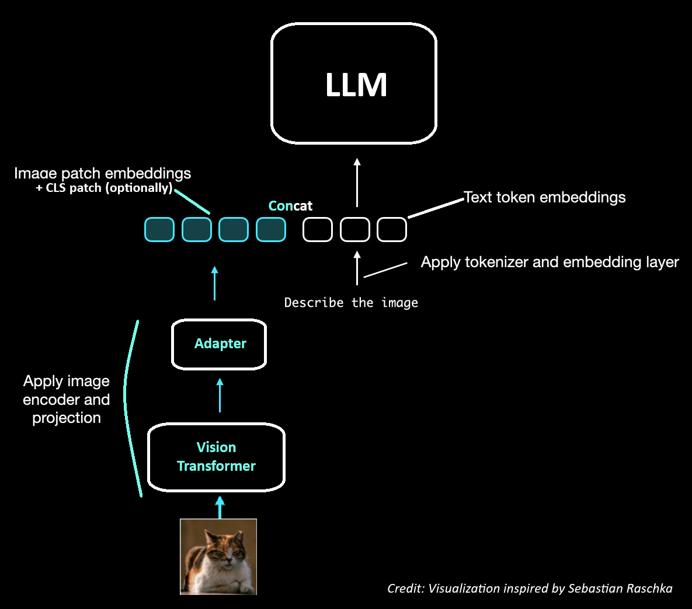
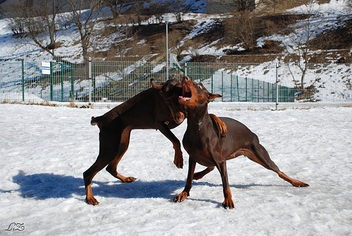

# Towards Multimodal LLMs 

&nbsp;

## Follow up of *Vision Transformer (ViT) from scratch*

Once the ViT is trained for classification, we can use it as an image encoder for the multimodal SFT/VQA training of our
LLM. Alternatively we can still load a pretrained battle-tested ViT from a CLIP model: https://github.com/openai/CLIP.

There are multiple ways to inject our hidden states into the LLM aka "*Modality fusion*", 2 known methods are:
- Concatenating the ViT's image embeddings/hidden states with the LLM's text input embeddings, also known as Early
  Fusion/Unified Embedding.

- Using the ViT's hidden states as keys & values inside the attention mechanism directly, we'll get text queries
  attending to image features, also known as Late Fusion/Cross Modality Attention.

This is when `ViTAdapter` enters the room.  
The ViT's embedding space is very likely not the same as the GPT's one even though they both share the
same dimension (in my case), because they weren't trained together. Ie vectors are pointing to different directions in
the space for the same thing. The Adapter/connector is used during the multimodal SFT/VQA training to align the 2 spaces.

Note: The adapter is also used to down/up-project the ViT's hidden states to match the LLM's embedding dimension (in the
case there is a dimension mismatch but here we're both in 768D).

&nbsp;

## Vision Language Model (VLM) from scratch

    

&nbsp;

We will adopt the first method visualized above, *Early fusion*, as our way to inject vision to our 124M GPT2-Small.   
We also use the original pretrained ViT from Google for the image encoder:
https://huggingface.co/google/vit-base-patch16-224.  
Our GPT2-Small is simply pretrained/initialized from OpenAI weights.

### Training

There are various ways to approach the training (what to freeze? partial? PEFT? Adapter hparams etc...) but to keep
things simple, only the ViT will be frozen, while the adapter and the GPT2-Small will be fully trained.  

We utilize the [Flickr8k dataset](https://huggingface.co/datasets/jxie/flickr8k) as image-caption pairs where the model
will be trained to generate captions after seeing the image.  

More specifically: image + text embeddings get full attention, but for the Cross Entropy loss, we only consider the text
tokens (caption) part and ignore the image tokens/patches (the last image patch starts the first text prediction).  

This is also a reason why we remove the classification head from Google's ViT, we are only interested in the image
embeddings/last hidden states (patches) produced by the ViT.

### Result on a sample from the test set

After 2 epochs of training, we can see our VLM GPT2-small has learned from images.  
To be more accurate, we're closer to capturing some visual nuances, using words that fit, akin to sentiment
analysis, rather than an exact and sensible description of the image.

For example, for the first image of the test set:

the model generated:

`> A black and white dog is biting something .`

It recognizes a *dog* and approximates its color *black* (shadowed for dark-brown), it also identifies the
action of *biting*, though the object remains unclear *something*.  
One funny thing is its way of expressing the predominant snow via the *white* adjective which is incorrectly attributed
to a dog’s color.  

From this quick and simple training, for nuance/sentiment analysis it's not too bad, `["black", "white", "dog", "biting", "something"]` words are
all present in the image but it would require more optimizations and potentially a larger/modern architecture to
get a precise description.

