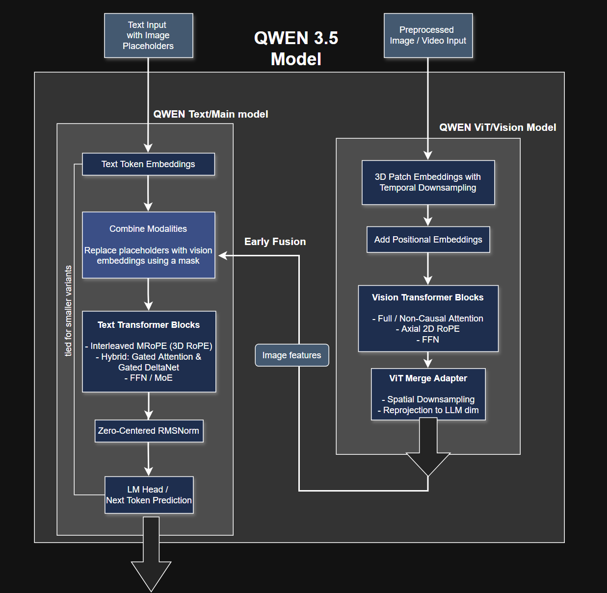
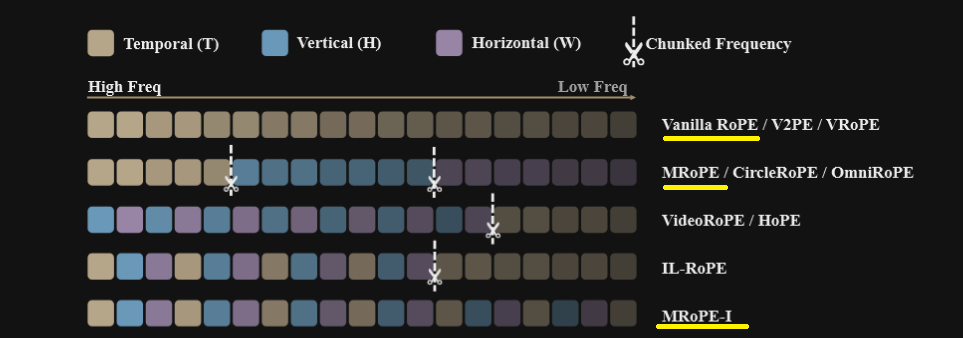
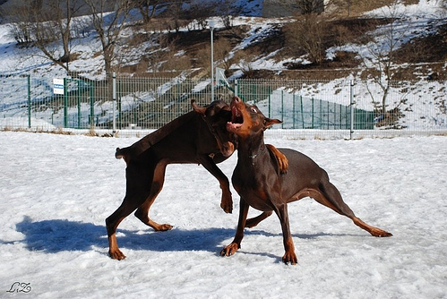

# Multimodal Qwen 3.5 from scratch

## Table of Contents

- [Overview](#multimodal-qwen-35-from-scratch)
- [Changes from Qwen3-Next](#changes-from-qwen3-next)
- [Vision-specific changes](#vision-specific-changes)
- [Changes for the final Multimodal Qwen3.5 VLM](#changes-for-the-final-multimodal-qwen35-vlm)
  - [Details on Multimodal RoPE](#details-on-multimodal-rope)
  - [MRoPE-I variant](#mrope-i-variant)
- [Generation Multimodal test](#generation-multimodal-test)
- [Acknowledgments](#acknowledgments)

---

&nbsp;

Official Blogpost: https://qwen.ai/blog?id=qwen3.5

If we could summarize the Qwen 3.5 architecture in a single sentence: *It's a Multimodal Qwen3-Next.*  
They re-used the same ViT from Qwen3-VL and coupled it with their Qwen3-Next text model.

I'm not going to re-introduce the main text model, Qwen3-Next, it has been implemented from scratch and detailed
here: https://github.com/casinca/LLM-quest/blob/master/llm_quest/qwen/qwen3_next/

&nbsp;

*High level flow chart for the Qwen3.5 VLM.*


&nbsp;

## Changes from Qwen3-Next

These changes are from the Qwen3-Next implementation, and only concern text (later section for MRoPE-I):

- Switch from MoE to dense arch/FFN for loading smaller versions of the Qwen3.5 lineup and for local generation tests
- Fuse:
    - GatedAttention's Q and the Gate projections to match HF for loading pretrained weights: `MRoPEGatedAttention`
    - Q,K,V and the 3x 1D convolutional layers in GatedDeltaNet: `FusedGatedDeltaNet`
- More rigorous with dtypes now, all weights are in bf16 except:
    - `ZeroCenteredRMSNorm` in fp32 only for GDN (linear attention)
    - `log_A` in fp32 in GDN

&nbsp;

## Vision-specific changes

Compared to our original ViT `ViTModel` implemented in
[vision_transformer](https://github.com/casinca/LLM-quest/blob/master/llm_quest/multimodal/vision_transformer/README.md),
changes are architectural:

- We switch from 2D ($H \times W$ image only) to 3D patch embeddings (with extra temporal/time dimension, 
$T \times H \times W$)
- Q, K, V in vision attention (i.e., bidirectional/full/non-causal) are fused to load pretrained weights
- Q, K, V have biases added
- Specific Axial 2D RoPE (but classic learned positional embeddings are also kept on top)
- The Qwen3 ViT patch embedding also performs temporal downsampling (reducing the number of frames/time dimension)
  controlled by the `temporal_patch_size` argument, whereas our original `ViTAdapter` was only doing feature
  reprojection to the text model/LLM.
- We had a classification head for the ViT and the adapter was in the training loop.  
Here the adapter is integrated as
  the head of the ViT. i.e., the Qwen3 ViT output is directly reprojected to the embedding dimension of the text
  model/LLM.
- The new head `ViTMergeAdapter` isn't just reprojecting, it also performs spatial downsampling controlled by the
  `spatial_merge_size` argument (reducing the number of patches, in both directions width and height, within an image).

&nbsp;

## Changes for the final Multimodal Qwen3.5 VLM


MRoPE (Multimodal RoPE/ 3D RoPE) takes over the classic 1D RoPE (Qwen3-Next) in order to make the model understand
spatio-temporal (T, H, W) positional information for our image/video patches.

&nbsp;

### Details on Multimodal RoPE

MRoPE can be seen as a 3D RoPE, where tokens/patches have a position expressed as 3 coordinates (T, H, W) unlike the
classic 1D RoPE, which uses a single coordinate position in the sequence. 

&nbsp;

Why is it needed?

In classic 1D RoPE, position_ids is a 1D sequence: [0, 1, 2, 3, 4, ...].
An image being a 2D grid (patches). If we just give image patches 1D sequential positions, the model doesn't
know which patch is directly below another patch.

For example, let's take an image divided into a 3x3 grid of patches:
```	
[0] [1] [2]
[3] [4] [5]
[6] [7] [8]
```

When it's flattened (after `PatchEmbedding3D`), we get a 1D flat sequence of patches for the transformer block:
`[0, 1, 2, 3, 4, 5, 6, 7, 8]`

If we use classic text 1D RoPE, we would only be encoding the position along this flat sequence:
  - patch [2] and patch [3] are next to each other in the flat sequence but in reality, they are spatially far apart in
  the 2D grid above.

Hence the reason to also encode the spatial information for the final VLM.

MRoPE also reduces elegantly to classic 1D RoPE when there's only text input (i.e., T, H, W are equal and are
incremented  together for text tokens).  
The same prompt with the `Qwen3_5VLM` model and `Qwen3_5TextModel` yields the same response. This can be compared in
`qwen3_5_generate_text_only.py`.


### MRoPE-I variant

In order to encode 3D positions we divide the rotary coefficients (i.e., cos(mθ) and sin(mθ)) into 3 sections for each dimension (T, H, W).  
If we were to split them following a contiguous/chunked pattern: `[TTT...HHH...WWW]` like classic MRoPE (see image
below), it would mean all the Time(T) dimensions would fill all the first coefficients (which represent high
frequencies) and all the Height(H) and Width(W) would fill the second and third buckets (which respectively represent
mid and low frequencies).

We would end up with a less accurate representation of patch orders, per "stacked dimensional" information.  
So the Qwen team further revisited their MRoPE, and instead interleaved the rotary coefficients 
`[T,H,W, T,H,W, ...,]` among all 3 dimensions, which gives a better and enriched representation of patch orders, where
all 3 dimensions are exposed to all frequencies, ranging from high to low.

&nbsp;




*Figure 3 of the "Revisiting Multimodal Positional Encoding in Vision-Language Models" paper*


This is done in the `RoPE.interleave_mrope_coeffs` following HuggingFace implementation and the `mrope_section` argument
determines the splits between the 3 dimensions (T, H, W).

### Additional notes:

When an input is multimodal, it should already be "prepared" (at least the way HF does it and here).  
This means the text sequence length doesn't change, in the model because of vision input: we are not concatenating the
prompt with the vision tokens during the forward or in the `__init__`, the text input is already expanded with image
placeholder/special tokens IDs that match the number of real vision tokens/patches.  
Therefore, we simply use a mask to replace the image placeholder/special token IDs in the input sequence with the vision token/patch embeddings from the vision model. This is done in the `Qwen3_5VLM.forward` method.

&nbsp;

### Generation Multimodal test

In `qwen3_5_generate_multimodal.py`, we test the vision capabilities of the model with the same image (from flickr8k
dataset) fed to the from-scratch Multimodal GPT-2 implemented
[here](https://github.com/casinca/LLM-quest/blob/master/llm_quest/multimodal/README.md).



&nbsp;

The GPT-2 VLM was a 5-mins training job, so it's not a very fair comparison, the difference is obviously quite high:

```text
prompt = "What do you see in the image?"

max_gen=50, temp=1.0, seed=123

Our Qwen3.5-0.8B:

"<think>

</think>

In the image, two large Doberman pinschers are playing energetically in a snowy field. The animals are bickering or fighting — one is aggressively lying on its side while the other has its head thrown back, mouth open as if neighing"
```

&nbsp;

## Acknowledgments

- Qwen3.5 Blogpost: https://qwen.ai/blog?id=qwen3.5  
- Multimodal RoPE / MRoPE (Qwen2-VL: Enhancing Vision-Language Model's Perception of the World at Any Resolution):
 https://arxiv.org/abs/2409.12191
- MRoPE-I Variant (Revisiting Multimodal Positional Encoding in Vision-Language Models): https://arxiv.org/abs/2510.23095