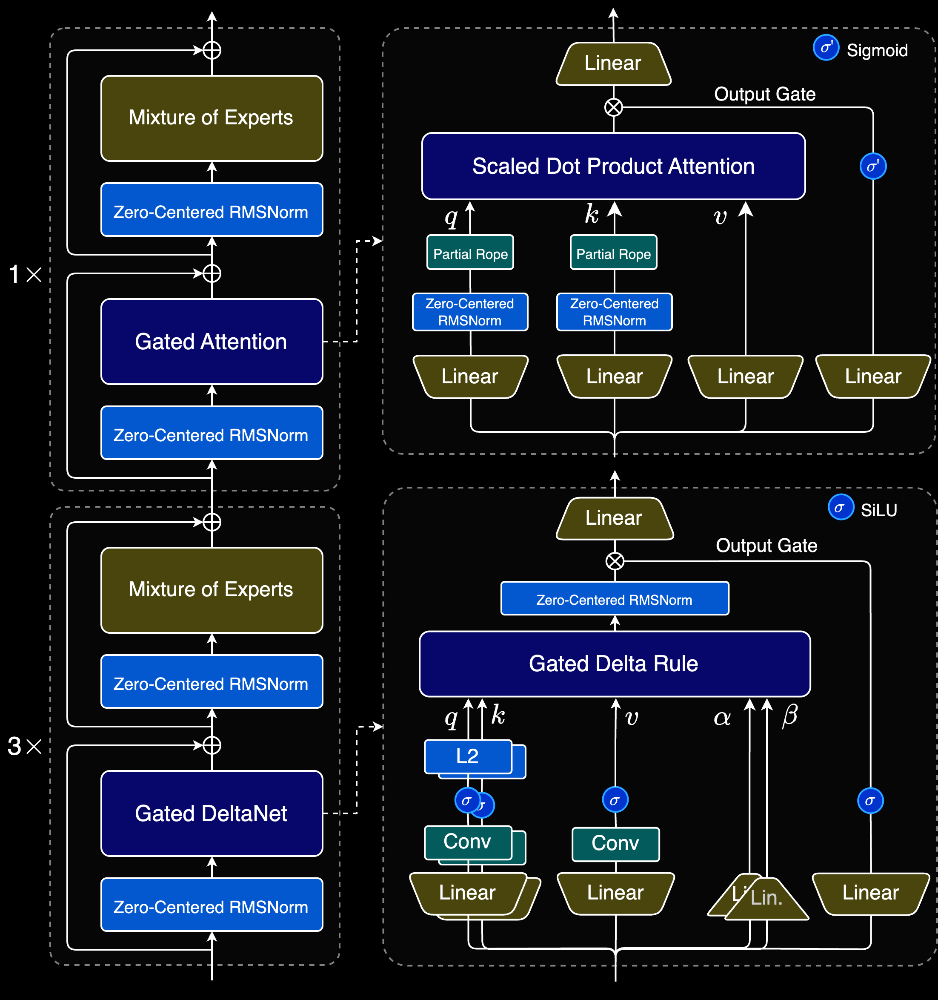

# Qwen3-Next from scratch

At the time of writing, [Qwen3-Next](https://qwen.ai/blog?id=4074cca80393150c248e508aa62983f9cb7d27cd&from=research.latest-advancements-list) is the most complex open-source LLM architecture (text-only) from a top lab,
incorporating SOTA subquadratic attention variant and their own, more classic, Gated Attention in a hybrid package.

An edit of the Venn diagram from this paper: ["Back to recurrent processing at the crossroad of transformers and
state-space models"](https://www.nature.com/articles/s42256-025-01034-6), this is where we could fit Qwen3-Next:

&nbsp;

## Changes from Qwen3 MoE models

Besides less architecturally impactful changes, the main highlight of Qwen3-Next is its hybrid attention mechanism
architecture which balances speed, efficiency and performance.

- We are alternating attention blocks at a 3:1 ratio between:
  - **Gated DeltaNet (GDN)**: https://arxiv.org/abs/2412.06464 (More details in 
  [From Linear Attention to Gated DeltaNet](https://github.com/casinca/LLM-quest/blob/master/llm_quest/linear_attention_to_gated_deltanet/README.md))
  - **Gated Attention**: https://arxiv.org/abs/2505.06708 (More details in [Gated Attention](#gated-attention) section)

- Partial RoPE: Only the first 25% of the head dimensions are rotated with RoPE in Gated Attention ([Why no RoPE in GDN?](#why-no-rope-gdn))

- They removed all RMSNorm, and replaced them with Zero-Centered RMSNorm (which is RMSNorm that is initialized with
  0 centered weights instead of 1s, see: [Zero-Centered RMSNorm](#zero-centered-rmsnorm))

- They also added a weighted shared expert, combined with the routed ones, in their MoE block (not seen in the
  architecture picture). Same as DeepSeek MoE except they use a sigmoid to scale the shared expert output.  
  Very similar to part c) of [my experimental weighting shared experts stuff](https://github.com/casinca/LLM-quest/blob/master/llm_quest/experimental/weighting_shared_experts/Readme.md) from earlier this year.

- Despite the "L2" block being the same color as Z-C RMSNorm in the Qwen picture, it has nothing to do with weight decay
  (L2 regularization) for RMSNorm. It is L2 normalization. They are just dividing Q and K vectors by their Euclidean Norm/reduce their magnitude to unit length to
  keep only the direction as features.

- They mentioned Multi Token Prediction (MTP) in the blogpost and linked the classic papers about it (already cited in
  the DeepSeekV3 implementation) but it wasn't made public in their inference
  code, there wasn't enough context to properly implement it the way they did, but it's still a worthy difference to
  mention from Qwen3 models.

&nbsp;

&nbsp;

### Gated Attention

They tested different scenarios (see Table 1, p.4 of the paper) but for their implementation, they ended up using a classic GQA (Grouped-Query Attention) where the SDPA output/context tensor is scaled down (or not) by an added gate.  
Similar to GLU types in FFNs, the gate here is a linear projection reduced to a (0, 1) range with a sigmoid thus acting as a factor to modulate the attention output.  

*Why doing this?*  
Qwen mention it is to reduce low-rank issues from the attention (ie low expressive power/richness of context).  
The activation function is a classic to introduce non-linearity, the gate will learn to dynamically modulate the attention output ie, dampen or not features, *controlling the flow of information* as they say.

### Zero-Centered RMSNorm
Zero-Centered RMSNorm is not what it seems/interpreted as doing:

$$ x_{\text{RMS\_scaled}} = \frac{x}{\sqrt{\text{mean}(x^2) + \epsilon}} $$

$$ x_{\text{Zero\_Centered}} = x_{\text{RMS\_scaled}} - \text{mean}(x_{\text{RMS\_scaled}}) $$

They mean, in fact, initializing the weights/coeff as 0 centered (`nn.Parameter(torch.zeros(...))`) unlike traditional 1s
with `torch.ones()`.  Since multiplying by 0 would make no sense, they add for the forward pass a $+1$ constant to compensate, ie $x \cdot (1+w)$

So basically it's zero centered "weights", not zero centered "RMS", they are changing the baseline to 0 instead of 1
and the model now learns to change the scale from 0 and they just shift by 1 for the correct activation scaling.

The whole point was to counter abnormally large weights in QK norm, centering weights around 0 indeed helps as a
better starting point.
But the additional main reason they are doing this is as a very smart trick to make L2 regularization work:

If they apply L2 on a classic RMSNorm it will push the coeff/weights (starting from 1) to 0, which will ruin the RMSNorm
forward.
But if they apply L2 on Zero-Centered weights, it'll still push the weights (starting from 0) to 0 (weights are
still kept low) but to avoid having a coefficient of 0, for the forward only, they just offset by adding 1 to keep the correct RMSNorm scaling. 

Pushing weights towards 0, intrinsically pushes the coefficients towards
$(1 + \text{weights} (\approx 0)) \approx 1$ which is kind of what we'd want for a reasonable scaling range (whereas for
classic RMSNorm, weights = coeff = potential explosion).  

All in all, making a RMSNorm with L2 possible and keeping weights in stable range.  
This is more of an optimizer detail (where normalization layers are included in the optimizer step) than an
architectural change. This is not always the case, for example: https://github.com/karpathy/minGPT/issues/23.

### Gated DeltaNet

Gated DeltaNet (GDN) is a SOTA gated variant, from Nvidia researchers, of the original [linear
attention](https://arxiv.org/abs/2006.16236) and is a strong contender against other gated variants.  
Their scalable [DeltaNet](https://arxiv.org/abs/2406.06484) (without gating) had already perfect scores in "in-context" learning but also in fuzzy and noisy recall in MAD
benchmark.  
[@sustcsonglin](https://github.com/sustcsonglin) the lead author shared all the details on her excellent blog: https://sustcsonglin.github.io/blog/2024/deltanet-1/

Originally GDN was incorporated in hybrid architecture with SWA and/or [Mamba](https://arxiv.org/abs/2312.00752) attention blocks (like the Gated
DeltaNet-H2 model) but Qwen with Qwen3-Next opted instead to implement GDN with their own Gated attention mentioned
above.

Put simply, GDN is the culmination of the evolution of linear attention with the [delta
rule](https://direct.mit.edu/books/edited-volume/5431/chapter-abstract/3958517/1960-Bernard-Widrow-and-Marcian-E-Hoff-Adaptive)
and a gating mechanism.  
More details on Linear attention formula and how we end up to GDN in: [From Linear Attention to Gated DeltaNet](https://github.com/casinca/LLM-quest/blob/master/llm_quest/linear_attention_to_gated_deltanet/README.md)

*Note:* Alpha (gating term for scaling $S_{t-1}$ in `gated_delta_rule`) is mentioned in the GDN paper equation 10 as
$\alpha_t \in (0, 1)$.  
It's not just a simple scalar factor learned from a linear layer
with projections reduced to (0,1) by a sigmoid but more sophisticated as Space State models (SSMs) are doing: 
$\alpha_t = e^{-A \cdot \Delta t_t}$ part of equation 4 of the Mamba paper.  
This is implemented in the helper function `compute_alpha_factor`.

&nbsp;

### Making sense of the Gated Delta Rule equation and the code

The GDN paper equation 10 is writtent as:
$$ S_t = S_{t-1}(\alpha_t(I - \beta_t k_t k_t^T)) + \beta_t v_t k_t^T $$

With:  
$S_t$: The state matrix at the current time step $t$ shape `(d_value, d_key)`.  
$S_{t-1}$: The state from the previous step.  
$\alpha_t$: The gating term. Scalar $\in (0, 1)$ (computed as the method cited above). It controls how much of the
entire past memory is forgotten.  
$\beta_t$: writing strength/learning rate. Also a scalar. It controls how much of the new
information is written into the memory.  
$k_t$: The key vector for the current token, shape `(d_key, 1)`.  
$v_t$: The value vector for the current token, shape `(d_value, 1)`.  
$I$: identity matrix, shape `(d_key, d_key)`.  

If we re-arrange the equation to match my implementation (also slightly different than Qwen3-Next):  
We ignore the gate $\alpha_t$ for now, we have:

$S_t = S_{t-1} (I - \beta_t k_t k_t^T) + \beta_t v_t k_t^T$

distribute $S_{t-1}$:  
$S_t = S_{t-1} - \beta_t (S_{t-1} k_t) k_t^T + \beta_t v_t k_t^T$

factorizing with $\beta_t$ and $k_t^T$:  
$S_t = S_{t-1} + \beta_t (v_t k_t^T - (S_{t-1} k_t) k_t^T)$  
$S_t = S_{t-1} + \beta_t (v_t - S_{t-1} k_t) k_t^T$

and finally adding back the gate $\alpha_t$ to scale $S_{t-1}$:  
$$S_t = (\alpha_t S_{t-1}) + \underbrace{\beta_t (\overbrace{v_t - \underbrace{(\alpha_t S_{t-1}) k_t}_{\text{v\_old}}}^{\text{Delta}})}_{\text{Scaled Delta}} k_t^T$$

This is the formula implemented in the code.  
Step by step:

$\alpha_t S_{t-1}$ as `gated_prev_state = alpha_t * prev_state`  
$(\alpha_t S_{t-1}) k_t$ as `v_old = gated_prev_state @ k_t.unsqueeze(-1)`  
$v_t - (\alpha_t S_{t-1}) k_t$ as `delta = v_t - v_old.squeeze(-1)`  
$\beta_t (v_t - (\alpha_t S_{t-1}) k_t)$ as `scaled_delta = beta_t * delta`  
$\beta_t (v_t - (\alpha_t S_{t-1}) k_t) k_t^T$ as `state_update = scaled_delta.unsqueeze(-1) @ k_t.unsqueeze(2)`

and finally:  
$S_t = \underbrace{(\alpha_t S_{t-1})}_{\text{gated\_prev\_state}} + \underbrace{\beta_t (v_t - (\alpha_t S_{t-1}) k_t)
k_t^T}_{\text{state\_update}}$ as `prev_state = gated_prev_state + state_update`

&nbsp;

> We end up with the main 2 concepts of the gated delta rule:
> - Forget: start with the previous state and apply decay.
> - Write: build new state update and add it to the decayed state.

Overall our attention/context output is:  
$o_t = S_t q_t$ as `attn_t = prev_state @ q_t.unsqueeze(-1)`

&nbsp;

## Implementation differences with Official Qwen3-Next

For readability and simplicity, there are some differences compared to the efficient Qwen's own implementation:
- Not using FLA with the chunked Gated delta rule algorithm, but the recurrent simpler version.
- Not fusing the linear and convolutional layers. We are performing 6 separate projections (Q, K, V, gate, alpha, and
  beta), this is easier to follow along with the architecture picture above.

  &nbsp;

---

*Why are we not also using RoPE for GDN just like for the standard quadratic attention?  
The inherent way of computing linear attention (recurrent/sequentially) already provides a natural sense of order.  
This is also why we don't use a causal mask for recurrent GDN (like we do for Gated Attention) but only use an attention/padding mask. We only ever have access to the previous state $S_{t-1}$ and the current input $x_t$ for $S_t$, not
$S_{t+1}...$  
For training efficiency (whole sequence at once) the convolutional layer via padding takes care of
the causality.

&nbsp;

## Acknowledgements

All resources mentioned have already been at least hyperlinked through the readme but for grouped accessibility:

- Qwen blogpost: https://qwen.ai/blog?id=4074cca80393150c248e508aa62983f9cb7d27cd&from=research.latest-advancements-list
- Gated Attention: https://arxiv.org/abs/2505.06708
- Songlin Yang blogpost on DeltaNet: https://sustcsonglin.github.io/blog/2024/deltanet-1/
- Linear attention: https://arxiv.org/abs/2006.16236
- DeltaNet improvement with parallelism: https://arxiv.org/abs/2406.06484
- Gated Delta Networks: https://arxiv.org/abs/2412.06464
- DeltaNet: https://proceedings.mlr.press/v139/schlag21a.html
- Delta rule:
  https://direct.mit.edu/books/edited-volume/5431/chapter-abstract/3958517/1960-Bernard-Widrow-and-Marcian-E-Hoff-Adaptive
- Mamba: https://arxiv.org/abs/2312.00752
- Venn diagram source: https://www.nature.com/articles/s42256-025-01034-6

