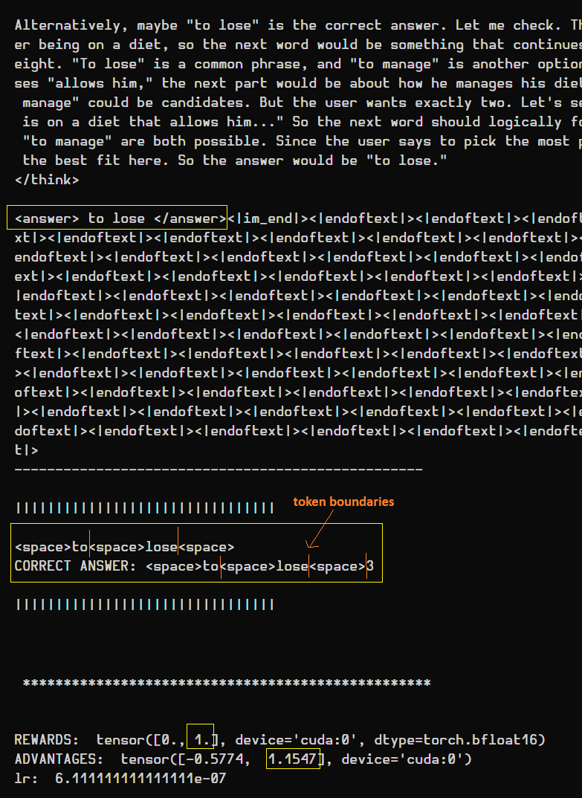

# Reinforcement Pretraining (RPT) from scratch*

**The HF tokenizer is the only external dependency, all the rest is from scratch: model, GRPO RLVR pipeline re-used for RPT
training.*

Reinforcement Pretraining is a clever idea from Microsoft researchers: https://arxiv.org/abs/2506.08007. As the name
suggests, mixing RL with a pretraining objective. They reframe next token prediction (NTP) as a reasoning task, giving
birth to Next Token Reasoning (NTR?).

BUT the beauty of RPT is that it isn't locked to NTP, on the contrary, it extends to Multi Token prediction (MTP)
elegantly/naturally. All of this without modifying the model architecture (compared to how MTP is done in DeepSeek V3,
with extra attached modules or the [original MTP paper](https://arxiv.org/abs/2404.19737) from Meta researchers).

&nbsp;

## Details

The 2-checks reward function they elaborated (see *3.2 Pre-Training with Reinforcement Learning in p.4* or the
`PrefixMatchingReward` class in `rpt_engine.py`) allows the model to be evaluated against, not just a single label (like
NTP), but a defined amount of labels as seen in the `RPTStructuredDataset` in `llm_quest/dataset.py` with the
`labels_length` hparam/argument.  

For example, for a single sample, if the context is: `"The capital of Fra"` and labels are `"nce is Paris and it's"`,
the model will be rewarded for predicting `"nce is Paris"` in 1 step.

**Note:** At the time of writing, from the current state of the paper, the "Pretraining" in RPT doesn't have the same
meaning as classic pretraining. The starting point isn't an untrained model but an already
pretrained+SFT+aligned/reasoning model, specifically they used a ` Deepseek-R1-Distill-Qwen-14B`.  
The authors do acknowledge this in *p.9* and mention it's an actual topic of research: doing RPT starting from an
earlier phase of the pipeline/stack.

&nbsp;

## RPT benefits

Per the authors' results (*4. Experiments on p.5*), RPT could bridge to/unlock a new pipeline, after reasoning, for
difficult tasks:  
The RPT'ed model is not just better at high entropy NTP, but NTP in general (ref *table 1* from the paper) than a
classic reasoning model, thus having a model with better autoregressive foundations. It's not crazy to hypothesize that
it could be better at SFT, better at being aligned, better at reasoning again. Creating a virtuous enhanced cycle.  
This is what the researchers tested in *4.3 Reinforcement Fine-Tuning with RPT* showing better results for RLVR (not
only post training but also pre RLVR training. So a better starting and ending checkpoint for RLVR with the RPT model).

&nbsp;

## RPT Training: Test with our from-scratch `Qwen3-0.6B` arch

Researchers used a ~23x larger model than the one used here, yet `Qwen3-0.6B` was able to follow through.  
MTP successes were rare compared to NTP (single token) due to the higher difficulty, but also because the model has a
tendency to add trailing spaces to its answers... which can ruin a whole group of rewards.

For example, below is a good MTP (3 tokens right out of a `labels_length=4`):

&nbsp;

If the last label had been the beginning of a word instead of a number, the reward would have been 0 because of the way
the Qwen tokenizer splits spaces + beginning of words and numbers differently, in addition to RPT rewards calculation
(valid boundary check).

Here the model's predicted trailing space is considered as a single token, which is valid because digit tokens aren't
tokenized with leading spaces but as 2 separate tokens (1 space and 1 digit), unlike words (space + word prefix = 1
token).  
So, if the last label was the beginning of a word, the single trailing space wouldn't have been considered a valid
boundary, thus the reward would have been wasted for the first 2 correctly predicted labels.

Overall the trailing problem can be handled with better prompting or penalization, among other things.

&nbsp;

## Difficulties encountered

### GRPO advantages calculation: edge case with z-scores and zero gradients

This is a problem inherent to how the original GRPO computes advantages as z-scores. For example, if we have a
group where generations give the exact same rewards, what becomes of the $\sigma$ standard deviation in the formula
$A = \frac{R - \mu}{\sigma}$? Zero.
Consequently, when in a group all rewards are the same, there's no gradient update from that group.

It's less of a problem at high scale training and larger group size (the larger the group size, less chance to happen),
but to keep it on consumer hardware with a group of 2 samples, it's a recurrent problem.

To solve this, numerous solutions can be found in the literature:
- [DAPO](https://arxiv.org/html/2503.14476v1): uses dynamic sampling (generates responses in a group until rewards are unequal)
- [OLMo 3](http://allenai.org/papers/olmo3): opted to discard groups of equal rewards
- We can add a small penalty/bonus to one of the rewards based on different criteria (length based like
  [AGPO](https://arxiv.org/abs/2503.15952), entropy based like [EDGE-GRPO](https://arxiv.org/abs/2507.21848), uniqueness of the response...)

In our case, dynamic sampling would be triggered way to often with a group size of 2 and would slow down the training.
We can't afford to ditch groups of equal rewards either, as at our small scale the data is precious, we want to make the
most of it.

The solution chosen here (specifically for RPT, with 3 types of rewards), was to follow an anchor/augmented reward
approach: Advantages are calculated with an extra 0 reward added to the group (ex: `Groups=2, R=[1, 1] -> R=[1, 1, 0]`).
Thus, when rewards are either all positive or all negative, the extra 0 reward breaks the equality and allows for non-zero advantages. When all rewards are 0 (i.e., the model properly returned
an answer but it's not the correct one), giving no signal was intended as a "neutral try again".

It is worth mentioning, however, that the DAPO team notes this can cause entropy collapse: If we keep pushing the
probability of known correct answers, the model can lose its ability to explore new, potentially better reasoning paths
for those questions.
In our small scale test and the RPT nature of the task, the model isn't getting enough correct answers to begin with to trigger this issue.

### Bad starting point

Initially, I tried RPT with a base GPT-2 Medium that underwent the reasoning RLVR pipeline in the alignment folder.
Unfortunately, the training wasn't intensive enough to steer the model to "exactly" follow the RPT instructions.
Therefore, despite the training working, 90% of the time rewards were negative because there were no `<answer> </answer>`
tags in the generated text.

With a well-established reasoning model (hybrid) like `Qwen3-0.6B`, the above problem disappeared.  
**Note:** I kept the DeepSeek `<answer> </answer>` tags, but from CoT or even instruct responses, it seems Qwen's models
prefer the `\boxed{}` tag, out of the box. It didn't pose a problem, even for its small size.

### Memory issues

In the current state, trying to stay in bf16 and fit everything in consumer CUDA-compatible hardware became
challenging for decent training conditions (larger batch size, larger num_samples/rollouts). Not because of the model
size, but because of the length of the reasoning traces, which quickly adds up with larger batch sizes and rollouts.
Also worth mentioning that since the whole pipeline is from scratch (except the tokenizer), there's also surely a lack of
optimization on my side.

To solve these problems, when revisiting RPT training, some optimizations were made:

- added optimized KV cache to the model
- option to use gradient checkpointing (trade speed for memory)
- customization of RPT instructions to steer the model to be more concise

Even after tweaking the RPT instructions to make the model less verbose, it would often "overthink", backtrack, the
usual `wait...Maybe...` or be overly cautious, thinking there is a trick to the question.
It ends up being a dilemma of reducing `max_gen` too much at the risk of not letting the model explore enough before giving a
final answer.

But RL came to the rescue naturally.  
When `<answer> </answer>` tags couldn't be extracted from the generated responses, it
meant the model had "thought" for too long and hit `max_gen`.  
Note: With bad gradient update hyperparameters, it can also be due to large update steps that lead to catastrophic forgetting, i.e., the model forgets its chat template
(`<thinking>` and `<answer>`tags).

So when no `<answer>` tags are extracted, a strong negative reward is given (`-10` default from the paper), thus the
model slowly learns to cut it short (at least staying ≤ `max_gen`) and give a final answer.

### Better hyperparameters

- Refactoring the `LearningRateScheduler` from the `engine.py` training loop, greatly improved the training stability.
Initially, with no warmup and high LR (5e-5), combined with a tight `max_gen`, the training start was too brutal.

    Starting from 0 up to the recommended lr of `1e-6` (50x smaller) greatly improved the training stability.
    No decay was used:
    - In SFT, the model sees the "truth" immediately. As it memorizes the data, we can slow down to
    refine the weights.
    - In RL, the model is exploring. It might not discover the "winning strategy" until later in the training.

    Therefore, I didn't want to penalize learning after warmup (but a slow careful decay can work I guess)

- No KL penalty (`beta = 0.0`) which seems to be a trend as newer models get better, didn't seem to trigger any reward hacking or issues.

- On top of that when used without entropy filtering, providing a single token of context to predict the next words is
bound to be unsuccessful, especially with a small model.
Therefore, a `min_context_tokens` argument was added to the `RPTStructuredDataset` to only consider samples with a
context length >= `min_context_tokens`, giving a bit more context to chew on for the model.

&nbsp;

## RPT: structured datasets vs continuous corpus of text

RPT was done on structured datasets (Omni-Math, Tabular type etc...), ie with independent samples. Doing entropy
filtering on these samples is straightforward because each sample has a truly distinct and defined beginning and end.

Doing entropy filtering for RPT on a continuous corpus of text (like classic pretraining) is a bit more tricky because
as we slide the window of context, the first token of each sample is considered a beginning, but in reality, it'll
likely be a continuation of the previous sample.  
This falsely leads the first tokens' predictions of each sample into high entropy predictions, because they are
considered as having no prior context and thus harder to predict.  

As mentioned in the last point, a `min_context_tokens` argument was later added to the `RPTStructuredDataset` as an
alternative to entropy filtering, as a quick fix to avoid high entropy predictions for each sample.

&nbsp;

## Future of Reinforcement Pretraining

At the time of this readme update, RLP ([Reinforcement as a Pretraining Objective](https://github.com/NVlabs/RLP)) by
Nvidia is an interesting inspiration following the steps of RPT.  

Unlike RPT, RLP was done as a final step of pretraining (no reasoning model required), there is also no need to implement
a reward function to score the model's responses, hence why they qualify themselves as "verifier free".  
The signal/reward is derived directly from the model's responses. More specifically, comparing log likelihoods of the model predicting the next token with CoT vs without CoT.  
We could reframe it as *"Did thinking about predicting the next token helped more than just predicting the next token
directly?"* this is what they call "information gain" in their paper.